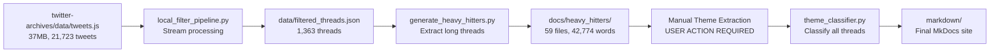

# DremelDocs Project Index

## 📚 Project Overview
**Name**: DremelDocs (formerly AstraDocs)
**Purpose**: Transform Twitter/X archive into curated philosophical/political knowledge base
**Status**: 85% complete (awaiting manual theme extraction)
**Stack**: Python 3.12, MkDocs Material, SpaCy, uv

---

## 🗂️ Directory Structure

```
dremeldocs/
├── 📁 scripts/                    # Core processing pipeline
├── 📁 tests/                      # Test suite (119 tests)
├── 📁 docs/                       # Documentation & content
├── 📁 data/                       # Working data directory
├── 📁 markdown/                   # MkDocs website content
├── 📁 config/                     # Configuration files
├── 📁 .serena/                    # Serena MCP project
├── 📁 .notes/                     # Historical/ephemeral docs
├── 📁 twitter-archives/           # Source Twitter data
└── 📄 Core Files                  # Project configuration
```

---

## 🔧 Core Scripts

### Main Pipeline Components

| Script | Purpose | Status | Location |
|--------|---------|--------|----------|
| `local_filter_pipeline.py` | Stream JSON processing, thread extraction | ✅ Complete | scripts/ |
| `generate_heavy_hitters.py` | Generate markdown for 500+ word threads | ✅ Complete | scripts/ |
| `theme_classifier.py` | Classify threads by user-defined themes | ⏳ Awaiting themes | scripts/ |
| `text_processing.py` | NLP utilities with SpaCy integration | ✅ Complete | scripts/ |

### Testing & Development Scripts

| Script | Purpose | Location |
|--------|---------|----------|
| `test_enhanced_extraction.py` | Test NLP tag extraction | scripts/ |
| `test_filename_generation.py` | Validate filename generation | scripts/ |
| `test_transformer_power.py` | Transformer model testing | scripts/ |

---

## 📖 Documentation

### Core Documentation

| Document | Description | Path |
|----------|-------------|------|
| `PROJECT_INDEX.md` | This file - comprehensive navigation | Root |
| `README.md` | Project overview and quick start | Root |
| `CLAUDE.md` | Instructions for Claude Code | Root |
| `PROJECT_KNOWLEDGE_BASE` | Serena memory - complete reference | .serena/memories/ |

### Technical Documentation

| Document | Purpose | Location |
|----------|---------|----------|
| `INDEX.md` | Documentation navigation | docs/ |
| `ARCHITECTURE.md` | System design and flow | docs/ |
| `API.md` | Script API reference | docs/ |
| `STATUS.md` | Current project status | docs/ |
| `workflow.md` | Development workflow | docs/ |
| `setup.md` | Environment setup | docs/ |
| `testing.md` | Testing framework | docs/ |

### Heavy Hitters Content

**Location**: `docs/heavy_hitters/`
**Count**: 59 markdown files
**Total Words**: 42,774
**Purpose**: Long-form philosophical/political threads for manual theme extraction

Key files:
- `index.md` - Navigation for all heavy hitters
- `THEME_TEMPLATE.md` - Template for user theme extraction
- Individual threads: `001-*.md` through `059-*.md`

---

## 🧪 Test Suite

### Structure
```
tests/
├── unit/                  # Unit tests (98 tests)
│   ├── test_text_processing.py
│   ├── test_generate_heavy_hitters.py
│   └── test_frontmatter_generation.py
├── integration/           # Integration tests (21 tests)
│   ├── test_filter_pipeline.py
│   └── test_end_to_end.py
├── fixtures/             # Test data and utilities
│   └── sample_data.py
└── conftest.py          # pytest configuration
```

**Coverage**: 89% on core modules
**Status**: 119/119 tests passing (100%)
**Command**: `uv run pytest tests/ --cov=scripts`

---

## 💾 Data Flow

### Input → Processing → Output



---

## 🎨 Website Structure

### MkDocs Configuration
**Location**: `mkdocs.yml`
**Theme**: Material with custom CSS
**Features**: Dark mode, responsive, metadata cards

### Content Organization
```
markdown/
├── index.md              # Homepage with dedication
├── about/                # AI collaboration page
│   └── ai-ethics.md     # Leftist perspective on AI
├── themes/               # Organized by classification
│   ├── philosophy/       # Philosophical threads
│   ├── politics/         # Political analysis
│   └── science/          # Scientific discussions
└── stylesheets/          # Custom CSS
    └── extra.css        # Courier Prime font, earthy colors
```

---

## 🔄 Workflow Pipeline

### Current State
1. ✅ **Data Extraction**: Complete
2. ✅ **Filtering**: 21,723 → 1,363 threads
3. ✅ **Heavy Hitters**: 59 generated
4. ⏳ **Theme Extraction**: BLOCKED - User action required
5. ⏳ **Classification**: Ready to run
6. ⏳ **Site Generation**: Ready to build

### Commands for Each Stage
```bash
# 1. Extract and filter
uv run python scripts/local_filter_pipeline.py

# 2. Generate heavy hitters
uv run python scripts/generate_heavy_hitters.py

# 3. [USER ACTION] Review docs/heavy_hitters/
# Fill out THEME_TEMPLATE.md → THEMES_EXTRACTED.md

# 4. Classify all threads
uv run python scripts/theme_classifier.py

# 5. Serve website locally
mkdocs serve

# 6. Build for deployment
mkdocs build
```

---

## 🛠️ Configuration

### Python Dependencies
**File**: `pyproject.toml`
**Manager**: uv
**Key packages**:
- pandas, ijson (data processing)
- spacy, en_core_web_lg (NLP)
- mkdocs, mkdocs-material (documentation)
- anthropic, openai (AI classification)
- click, loguru, tqdm (utilities)

### NLP Configuration
**Model**: SpaCy en_core_web_lg
**Config**: `config/nlp_settings.yaml`
**Domain vocabulary**: 70+ political/philosophical terms
**Installation**:
```bash
uv pip install https://github.com/explosion/spacy-models/releases/download/en_core_web_lg-3.8.0/en_core_web_lg-3.8.0-py3-none-any.whl
```

### Git Configuration
- Feature branches only
- Conventional commits
- Pre-commit hooks installed
- `.gitignore` configured

---

## 📊 Project Metrics

### Performance
- **Processing Time**: ~2 minutes for full pipeline
- **Memory Usage**: 50MB peak
- **Cost Savings**: $108 (avoided API calls)
- **Reduction Rate**: 96% (21,723 → 1,363 threads)

### Content Statistics
- **Total Tweets**: 21,723
- **Filtered Threads**: 1,363
- **Heavy Hitters**: 59 (500+ words each)
- **Total Content**: 42,774 words of philosophy/politics

### Code Quality
- **Test Coverage**: 89% on core modules
- **Test Pass Rate**: 100% (119/119)
- **Lines of Code**: ~2,500
- **Documentation**: Comprehensive

---

## 🔗 Cross-References

### Related Documentation
- Technical details → [`ARCHITECTURE.md`](docs/ARCHITECTURE.md)
- API reference → [`API.md`](docs/API.md)
- Current status → [`STATUS.md`](docs/STATUS.md)
- Testing guide → [`testing.md`](docs/testing.md)
- Setup instructions → [`setup.md`](docs/setup.md)

### Key Memories (Serena)
- Complete reference → `PROJECT_KNOWLEDGE_BASE`
- SpaCy/uv insights → `technical_learnings_spacy_uv`
- NLP setup → `project_nlp_infrastructure`
- Quick commands → `suggested_commands`

### Session History
- Development timeline → `.notes/session_history/`
- Cleanup summary → `.notes/CLEANUP_SUMMARY.md`
- Best practices → `.notes/SERENA_MEMORY_BEST_PRACTICES.md`

---

## 🚀 Quick Start

```bash
# Clone and setup
cd /home/percy/projects/dremeldocs
uv pip install -r requirements.txt

# Run tests
uv run pytest tests/

# Process data
uv run python scripts/local_filter_pipeline.py
uv run python scripts/generate_heavy_hitters.py

# Review heavy hitters
ls docs/heavy_hitters/*.md

# [MANUAL STEP] Extract themes
# Edit THEME_TEMPLATE.md → THEMES_EXTRACTED.md

# Complete processing
uv run python scripts/theme_classifier.py

# Preview site
mkdocs serve
```

---

## 📝 Notes

- Project is 85% complete, blocked on manual theme extraction
- All infrastructure ready for final processing
- Estimated 1-2 hours user work + 20 minutes automated processing
- Website design complete with romantic dedication to Meredith

---

*Generated: 2025-01-23 | DremelDocs Project Index v1.0*