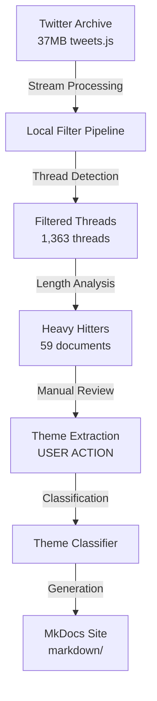

# DremelDocs Project Index

## 📚 Project Overview

**DremelDocs** is a sophisticated Twitter archive processing pipeline that transforms 21,723 tweets into a curated MkDocs knowledge base focused on philosophical and political content. The system employs advanced NLP techniques to extract, filter, and classify meaningful discourse threads.

### Key Metrics
- **Input**: 37MB Twitter archive (21,723 tweets)
- **Output**: 1,363 filtered threads → 59 heavy hitter documents
- **Completion**: 85% (blocked on manual theme extraction)
- **Test Coverage**: 119 tests, 100% passing
- **Tech Stack**: Python 3.12, SpaCy, MkDocs Material, uv package manager

---

## 🏗️ Architecture

### System Components



### Directory Structure

```
dremeldocs/
├── 📁 config/              # Configuration management
│   ├── pipeline.yml        # → Centralized path configuration
│   ├── environments/       # → Environment-specific settings
│   └── loader.py          # → Configuration loader (planned)
│
├── 📁 scripts/             # Core processing pipeline
│   ├── local_filter_pipeline.py    # → Entry point: tweet extraction
│   ├── generate_themed_markdown.py # → Heavy hitter document generation
│   ├── theme_classifier.py        # → Thread classification engine
│   ├── run_full_pipeline.py       # → Orchestration script
│   └── archived_experiments/      # → Historical implementations
│
├── 📁 data/               # Processing artifacts
│   ├── filtered_threads.json      # → 1,363 extracted threads
│   ├── classified_threads.json    # → Theme-tagged threads
│   └── vocabularies/              # → Domain vocabulary definitions
│
├── 📁 markdown/           # MkDocs source (PRODUCTION)
│   ├── index.md                   # → Homepage
│   ├── themes/                    # → Revolutionary theory content
│   ├── analysis/                  # → Critical analysis section
│   └── about/                     # → Project documentation
│
├── 📁 docs/               # Staging documentation
│   └── heavy_hitters/             # → 59 long-form threads for review
│
├── 📁 tests/              # Comprehensive test suite
│   ├── unit/                      # → Module-level testing
│   ├── integration/               # → End-to-end workflows
│   └── scripts/                   # → Script-specific tests
│
└── 📁 templates/          # MkDocs theme customization
```

---

## 🔄 Data Pipeline

### Processing Stages

| Stage | Script | Input | Output | Status |
|-------|--------|-------|--------|--------|
| 1. Extract | `local_filter_pipeline.py` | tweets.js (37MB) | filtered_threads.json | ✅ Complete |
| 2. Analyze | `generate_heavy_hitters.py` | filtered_threads.json | docs/heavy_hitters/*.md | ✅ Complete |
| 3. Review | Manual Process | heavy_hitters/*.md | THEMES_EXTRACTED.md | ⏳ **BLOCKED** |
| 4. Classify | `theme_classifier.py` | THEMES_EXTRACTED.md | classified_threads.json | ⏳ Waiting |
| 5. Generate | `theme_classifier.py` | classified_threads.json | markdown/themes/* | ⏳ Waiting |

### Key Algorithms

#### Thread Detection
- **Method**: Reply chain analysis using `reply_to_status_id`
- **Criteria**: Minimum 2 tweets per thread
- **Heavy Hitters**: Threads with 500+ total words

#### NLP Processing
```python
# Core NLP components (scripts/nlp_core.py)
- EnhancedTagExtractor: Advanced tag extraction with scoring
- ChunkScorer: Noun phrase relevance scoring
- DomainVocabulary: Domain-specific term recognition
- PatternMatcher: Regex-based pattern extraction
```

---

## 📖 API Reference

### Core Modules

#### `scripts/local_filter_pipeline.py`
**Purpose**: Extract and filter tweet threads from Twitter archive

| Function | Description | Parameters | Returns |
|----------|-------------|------------|---------|
| `process_archive()` | Main entry point | `archive_path: str` | `List[Thread]` |
| `detect_threads()` | Find reply chains | `tweets: List[Tweet]` | `List[Thread]` |
| `filter_quality()` | Apply quality filters | `threads: List[Thread]` | `List[Thread]` |

#### `scripts/theme_classifier.py`
**Purpose**: Classify threads and generate themed markdown

| Function | Description | Parameters | Returns |
|----------|-------------|------------|---------|
| `classify_threads()` | Apply theme tags | `threads: List, themes: Dict` | `Dict[str, List]` |
| `generate_markdown()` | Create MD files | `classified: Dict` | `int` (file count) |
| `clear_markdown()` | Clean output dir | `--clear-only` flag | `None` |

#### `scripts/nlp_core.py`
**Purpose**: NLP utilities and text processing

| Class | Description | Key Methods |
|-------|-------------|-------------|
| `EnhancedTagExtractor` | Extract meaningful tags | `extract_tags()`, `score_chunk()` |
| `ChunkScorer` | Score text relevance | `calculate_score()` |
| `DomainVocabulary` | Domain term management | `load_vocabulary()`, `match_terms()` |

---

## 🧪 Test Suite

### Structure
```
tests/
├── unit/                  # Unit tests (98 tests)
│   ├── test_text_processing.py
│   ├── test_generate_heavy_hitters.py
│   └── test_frontmatter_generation.py
├── integration/           # Integration tests (21 tests)
│   ├── test_filter_pipeline.py
│   └── test_end_to_end.py
├── fixtures/             # Test data and utilities
│   └── sample_data.py
└── conftest.py          # pytest configuration
```

**Coverage**: 89% on core modules
**Status**: 119/119 tests passing (100%)
**Command**: `uv run pytest tests/ --cov=scripts`

---

## 🚀 Quick Start

### Prerequisites
```bash
# Install uv package manager
curl -LsSf https://astral.sh/uv/install.sh | sh

# Clone repository
git clone <repository-url>
cd dremeldocs

# Install dependencies
uv pip install -e .
./install_spacy_model.sh
```

### Running the Pipeline
```bash
# Full pipeline execution
make pipeline

# Or step-by-step:
uv run python scripts/local_filter_pipeline.py     # Extract threads
uv run python scripts/generate_heavy_hitters.py    # Generate documents
# [USER ACTION: Review and extract themes]
uv run python scripts/theme_classifier.py          # Classify and generate

# Preview site
mkdocs serve  # http://localhost:8000
```

---

## 🎨 Website Structure

### MkDocs Configuration
**Location**: `mkdocs.yml`
**Theme**: Material with custom CSS
**Features**: Dark mode, responsive, metadata cards

### Content Organization
```
markdown/
├── index.md              # Homepage with dedication
├── about/                # AI collaboration page
│   └── ai-ethics.md     # Leftist perspective on AI
├── themes/               # Organized by classification
│   ├── philosophy/       # Philosophical threads
│   ├── politics/         # Political analysis
│   └── science/          # Scientific discussions
└── stylesheets/          # Custom CSS
    └── extra.css        # Courier Prime font, earthy colors
```

---

## 📋 Development Workflow

### Available Commands
```bash
make help         # Show all available commands
make test         # Run test suite
make lint         # Check code quality
make format       # Auto-format code
make clean        # Clean generated files
make docs-serve   # Serve documentation locally
make docs-build   # Build static site
```

### Code Quality Tools
- **Linter**: Ruff (configured in `.ruff.toml`)
- **Formatter**: Black
- **Type Checker**: mypy
- **Test Runner**: pytest with coverage

---

## 🎯 Current Status

### Completed ✅
- Pipeline infrastructure (streaming, thread detection, filtering)
- NLP processing components (tag extraction, scoring, vocabularies)
- Heavy hitter document generation (59 documents)
- Test suite implementation (119 tests, 100% passing)
- MkDocs Material theme configuration

### Blocked ⏳
- **Manual Theme Extraction**: User must review `docs/heavy_hitters/*.md` and complete `THEMES_EXTRACTED.md`
- **Theme Classification**: Waiting on extracted themes
- **Final Site Generation**: Dependent on classification

### Next Actions
1. 👤 **User Action**: Review heavy hitters and extract themes
2. 🤖 Run theme classification: `uv run python scripts/theme_classifier.py`
3. 🌐 Deploy site: `mkdocs build && mkdocs gh-deploy`

---

## 📚 Knowledge Base

### Design Decisions
- **Streaming Processing**: ijson for memory-efficient 37MB file handling
- **Two-Stage Filtering**: Length filter → Thread detection for quality
- **Human-in-the-Loop**: Manual theme extraction for better classification
- **Dual Directory Structure**: `markdown/` (production) vs `docs/` (staging)

### Performance Characteristics
| Metric | Value |
|--------|-------|
| Processing Time | ~2 minutes full pipeline |
| Memory Usage | 50MB peak (streaming) |
| Input Size | 37MB (21,723 tweets) |
| Output Size | 4MB filtered JSON |
| Reduction Rate | 96% (21,723 → 1,363) |

### Technical Patterns
```python
# SpaCy model loading (uv-specific)
try:
    nlp = spacy.load("en_core_web_lg")
except OSError:
    print("Install with: uv pip install [URL]")
    sys.exit(1)

# Twitter archive structure
window.YTD.category_name.part0 = [ /* array */ ]

# Thread detection logic
if tweet.reply_to_status_id == parent.id:
    thread.append(tweet)
```

---

## 🔗 Cross-References

### Related Documentation
- Technical details → [`ARCHITECTURE.md`](docs/ARCHITECTURE.md)
- API reference → [`API.md`](docs/API.md)
- Current status → [`STATUS.md`](docs/STATUS.md)
- Testing guide → [`testing.md`](docs/testing.md)
- Setup instructions → [`setup.md`](docs/setup.md)

### Key Memories (Serena)
- Complete reference → `PROJECT_KNOWLEDGE_BASE`
- SpaCy/uv insights → `technical_learnings_spacy_uv`
- NLP setup → `project_nlp_infrastructure`
- Quick commands → `suggested_commands`

### Session History
- Development timeline → `.notes/session_history/`
- Cleanup summary → `.notes/CLEANUP_SUMMARY.md`
- Best practices → `.notes/SERENA_MEMORY_BEST_PRACTICES.md`

---

## 🚀 Quick Start

```bash
# Clone and setup
cd /home/percy/projects/dremeldocs
uv pip install -r requirements.txt

# Run tests
uv run pytest tests/

# Process data
uv run python scripts/local_filter_pipeline.py
uv run python scripts/generate_heavy_hitters.py

# Review heavy hitters
ls docs/heavy_hitters/*.md

# [MANUAL STEP] Extract themes
# Edit THEME_TEMPLATE.md → THEMES_EXTRACTED.md

# Complete processing
uv run python scripts/theme_classifier.py

# Preview site
mkdocs serve
```

---

## 📝 Notes

- Project is 85% complete, blocked on manual theme extraction
- All infrastructure ready for final processing
- Estimated 1-2 hours user work + 20 minutes automated processing
- Website design complete with romantic dedication to Meredith

---

*Generated: 2025-01-23 | DremelDocs Project Index v1.0*