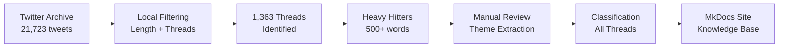

# DremelDocs 🌟

> Transform your Twitter/X archive into a curated MkDocs knowledge base

[](https://www.python.org/downloads/)
[](https://www.mkdocs.org/)
[](LICENSE)

## 🚀 Overview

DremelDocs is a local-first pipeline that transforms your Twitter/X archive into a beautifully organized MkDocs knowledge base. It intelligently extracts philosophical and political threads from thousands of tweets, organizing them by themes for easy navigation and reference.

### Key Features

- **⚡ Stream Processing**: Handles large archives (37MB+) without memory issues using ijson
- **🔍 Smart Filtering**: Two-stage local filtering to identify meaningful threads
- **💰 Zero API Costs**: Completely local processing - no expensive AI API calls
- **👤 Human-in-the-Loop**: Manual theme extraction for personalized organization
- **📚 MkDocs Ready**: Generates markdown formatted for static site generation

## 🔄 Pipeline Workflow



## 🚀 Quick Start

### Prerequisites

- Python 3.8+
- [uv](https://github.com/astral-sh/uv) package manager
- Twitter/X archive export

### Installation

```bash
# Clone the repository
git clone https://github.com/yourusername/astradocs.git
cd astradocs

# Install dependencies
uv pip install -e .
# or with pip
pip install -e .

# Install SpaCy language model
python -m spacy download en_core_web_sm
```

### Usage

1. **Place your Twitter archive**:

   ```bash
   unzip twitter-archive.zip -d source/
   ```

2. **Run the filtering pipeline**:

   ```bash
   python scripts/filter_pipeline.py
   ```

3. **Generate heavy hitter threads**:

   ```bash
   python scripts/generate_heavy_hitters.py
   ```

4. **Review and extract themes**:
   - Open `docs/heavy_hitters/` folder
   - Review the markdown files
   - Fill out `THEME_TEMPLATE.md` with your insights
   - Save as `THEMES_EXTRACTED.md`

5. **Classify all threads**:

   ```bash
   python scripts/theme_classifier.py
   ```

6. **Build MkDocs site**:

   ```bash
   mkdocs serve  # Preview locally
   mkdocs build  # Generate static site
   ```

## 📊 Performance

From a real Twitter archive (September 2025):

| Metric           | Value            |
| ---------------- | ---------------- |
| Input tweets     | 21,723           |
| Filtered threads | 1,363            |
| Heavy hitters    | 59               |
| Processing time  | ~2 minutes       |
| Memory usage     | 50MB peak        |
| Cost savings     | $108 (vs. GPT-4) |

## 🗂️ Project Structure

```
dremeldocs/
├── scripts/              # Processing pipeline scripts
│   ├── filter_pipeline.py      # Stage 1: Filter tweets
│   ├── generate_heavy_hitters.py # Stage 2: Extract heavy threads
│   ├── theme_classifier.py     # Stage 3: Classify all threads
│   └── text_processing.py      # SpaCy-enhanced text utilities
├── markdown/            # MkDocs content (generated)
├── docs/               # Project documentation
├── source/             # Twitter archive data
├── data/              # Intermediate JSON files
└── site/              # Generated MkDocs site
```

## 🎨 Customization

### Theme Configuration

Edit `mkdocs.yml` to customize your site:

```yaml
theme:
  name: material
  palette:
    primary: indigo
    accent: indigo
```

### Custom CSS

Add your styles to `markdown/stylesheets/extra.css`

### Frontmatter

All generated markdown files include rich frontmatter:

```yaml
---
title: "Thread Title"
date:
  created: 2025-01-22
categories: [philosophy]
thread_id: "unique-id"
word_count: 750
reading_time: 3
description: "Thread description..."
---
```

## 🤝 Contributing

Contributions are welcome! Please feel free to submit a Pull Request.

## 📝 License

This project is licensed under the MIT License - see the [LICENSE](LICENSE) file for details.

## 🙏 Acknowledgments

- Built with love for @BmoreOrganized's philosophical and political threads
- Powered by MkDocs Material theme
- Text processing enhanced by SpaCy NLP

## 📚 Documentation

For detailed documentation, see:

- [Architecture](docs/ARCHITECTURE.md)
- [API Reference](docs/API.md)
- [Development Guide](docs/INDEX.md)
- [Project Status](docs/STATUS.md)

---

Made with ❤️ for preserving radical thought and revolutionary discourse

