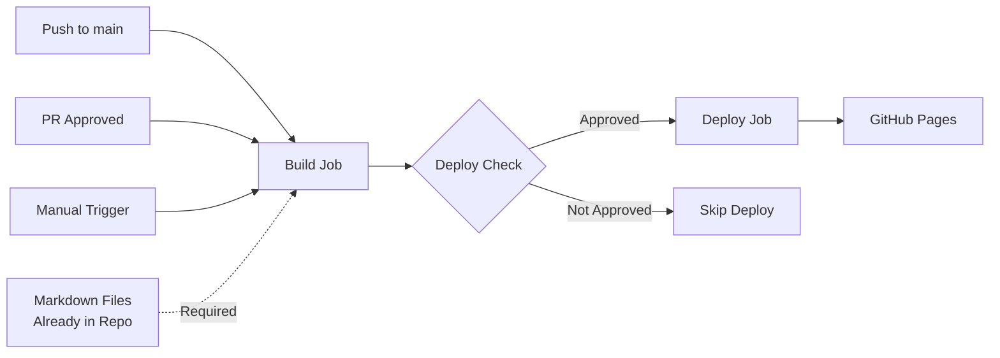

# CI/CD Pipeline Documentation

## Overview

DremelDocs uses GitHub Actions for continuous integration and deployment to GitHub Pages. This document provides comprehensive information about the CI/CD pipeline, branch strategy, and deployment process.

## Table of Contents

- [Pipeline Architecture](#pipeline-architecture)
- [Deployment Workflow](#deployment-workflow)
- [Branch Strategy](#branch-strategy)
- [Branch Protection Rules](#branch-protection-rules)
- [Triggering Deployments](#triggering-deployments)
- [Pipeline Components](#pipeline-components)
- [Troubleshooting](#troubleshooting)
- [Local Testing](#local-testing)

## Pipeline Architecture

The CI/CD pipeline is **strictly for publishing** the MkDocs site to GitHub Pages. It does NOT run the NLP processing pipeline.

The pipeline consists of two main jobs:

1. **Build Job**: Builds the MkDocs site from existing markdown files
2. **Deploy Job**: Deploys the built site to GitHub Pages

**Important**: The markdown content must be generated separately using the data processing pipeline and committed to the repository. This deployment workflow only publishes the pre-generated content.



## Separation of Concerns

### This Pipeline (CI/CD - Publishing Only)
- ✅ Builds MkDocs site from existing markdown
- ✅ Deploys to GitHub Pages
- ✅ Lightweight and fast (~1 minute)
- ❌ Does NOT run NLP processing
- ❌ Does NOT generate markdown content
- ❌ Does NOT install SpaCy or other NLP dependencies

### Data Processing Pipeline (Separate)
- Runs locally or in a separate workflow
- Processes Twitter archive data
- Runs NLP classification
- Generates markdown files
- Files are committed to repository
- See: `run_pipeline.py`, `scripts/` directory

## Deployment Workflow

### Workflow File

Location: `.github/workflows/deploy.yml`

### Triggers

The deployment workflow is triggered by:

1. **Direct Push to Main Branch**
   - Any commit pushed directly to the `main` branch
   - Typically used after merging approved PRs

2. **Pull Request Review Approval**
   - When a PR targeting `main` receives an approval review
   - Ensures code review before deployment

3. **Manual Workflow Dispatch**
   - Can be triggered manually from the Actions tab
   - Useful for redeployments or emergency updates

### Workflow Steps

#### Build Job

1. **Checkout Repository**
   - Uses `actions/checkout@v4`
   - Fetches the latest code

2. **Setup Python Environment**
   - Python version: 3.12
   - Uses `actions/setup-python@v4`

3. **Install UV Package Manager**
   - Uses `astral-sh/setup-uv@v3`
   - Enables caching for faster builds

4. **Install MkDocs Dependencies**
   - Installs only MkDocs and required plugins
   - **Does NOT install NLP dependencies** (SpaCy, etc.)
   - **Does NOT run the data processing pipeline**
   - Dependencies: `mkdocs`, `mkdocs-material`, `pymdown-extensions`, `mkdocs-minify-plugin`

5. **Setup GitHub Pages**
   - Configures Pages deployment settings

6. **Build MkDocs Site**
   - Runs `uv run mkdocs build --clean`
   - Generates static HTML site in `./site` directory
   - **Assumes markdown files are already generated and committed**

7. **Upload Build Artifact**
   - Uploads the built site for deployment

#### Deploy Job

1. **Conditional Deployment**
   - Only runs if:
     - Event is a push to main, OR
     - Event is a manual workflow dispatch, OR
     - Event is a PR review AND the review is approved

2. **Deploy to GitHub Pages**
   - Uses `actions/deploy-pages@v4`
   - Publishes the site to GitHub Pages
   - Site URL: `https://percy-raskova.github.io/dremeldocs/`

## Branch Strategy

### Main Branch (`main`)

- **Purpose**: Production-ready code
- **Protection**: Branch protection rules enforced
- **Deployments**: Automatic on merge/push
- **Access**: 
  - Direct pushes: Force push only (for emergencies)
  - Standard path: Through approved pull requests

### Development Branch (`dev`)

- **Purpose**: Active development and testing
- **Protection**: No branch protection
- **Deployments**: **NO automatic deployments**
- **Usage**:
  ```bash
  # Create dev branch (one-time setup)
  git checkout -b dev main
  git push -u origin dev
  
  # Regular development workflow
  git checkout dev
  git pull origin dev
  # Make changes
  git add .
  git commit -m "feat: your feature"
  git push origin dev
  ```

### Feature Branches

- **Naming**: `feature/<feature-name>` or `copilot/<task-name>`
- **Purpose**: Individual features or tasks
- **Lifecycle**: Created from `dev`, merged via PR to `dev`
- **Example**:
  ```bash
  git checkout dev
  git checkout -b feature/new-classifier
  # Make changes
  git push -u origin feature/new-classifier
  # Create PR: feature/new-classifier → dev
  ```

### Branch Flow Diagram

```
feature/xyz ─────┐
                 ├──> dev ────────> main ────> GitHub Pages
feature/abc ─────┘                    ↑
                                      │
                                   PR Review
                                   & Approval
```

## Branch Protection Rules

### Main Branch Protection

To properly protect the `main` branch, configure the following settings in GitHub:

**Repository Settings → Branches → Branch Protection Rules → main**

#### Required Settings

1. **Require a pull request before merging**
   - ✅ Require approvals: 1
   - ✅ Dismiss stale pull request approvals when new commits are pushed
   - ✅ Require review from Code Owners (optional)

2. **Require status checks to pass before merging**
   - ✅ Require branches to be up to date before merging
   - Required status checks:
     - `build` (the build job from deploy.yml)

3. **Require conversation resolution before merging**
   - ✅ All conversations must be resolved

4. **Require signed commits** (optional but recommended)
   - ✅ Require signed commits

5. **Do not allow bypassing the above settings**
   - ✅ Do not allow bypassing branch protection settings
   - Exception: Repository administrators (for emergency force push)

6. **Restrictions** (optional)
   - Restrict who can push to matching branches
   - Add specific users/teams if needed

#### Configuration via GitHub UI

1. Navigate to: `https://github.com/percy-raskova/dremeldocs/settings/branches`
2. Click "Add rule" or edit existing rule for `main`
3. Configure settings as listed above
4. Click "Create" or "Save changes"

#### Configuration via GitHub API (Alternative)

```bash
# Example using GitHub CLI
gh api repos/percy-raskova/dremeldocs/branches/main/protection \
  --method PUT \
  --field required_pull_request_reviews='{"required_approving_review_count":1}' \
  --field required_status_checks='{"strict":true,"contexts":["build"]}' \
  --field enforce_admins=true \
  --field required_conversation_resolution=true
```

## Triggering Deployments

### Method 1: Merge an Approved PR (Recommended)

1. Create a feature branch from `dev`
2. Make your changes and push
3. Open a PR: `feature/xyz → dev` (for testing)
4. Once tested, open PR: `dev → main`
5. Request review from team member
6. Once approved, merge the PR
7. Deployment triggers automatically

### Method 2: Direct Push to Main (Emergency Only)

**⚠️ Use only for critical hotfixes or when branch protection is temporarily disabled**

```bash
git checkout main
git pull origin main
# Make critical fix
git add .
git commit -m "hotfix: critical issue"
git push origin main  # Requires force push or admin override
```

### Method 3: Manual Workflow Dispatch

1. Navigate to: `https://github.com/percy-raskova/dremeldocs/actions/workflows/deploy.yml`
2. Click "Run workflow"
3. Select branch (usually `main`)
4. Click "Run workflow"

**Use cases:**
- Re-deploy after manual fix
- Deploy after configuration change
- Testing deployment process

## Pipeline Components

## Pipeline Components

### Source Files Structure

```
dremeldocs/
├── markdown/              # Source directory for MkDocs (docs_dir)
│   ├── index.md          # Homepage
│   ├── tags.md           # Tags page
│   ├── INSURRECTION.md   # Special content
│   ├── about/            # About section
│   ├── themes/           # Theme overview pages
│   ├── marxism/          # Marxism threads (314 files)
│   ├── economy/          # Economy threads (48 files)
│   ├── fascism/          # Fascism threads (43 files)
│   ├── covid/            # COVID threads (54 files)
│   ├── culture/          # Culture threads (14 files)
│   ├── imperialism/      # Imperialism threads (17 files)
│   ├── organizing/       # Organizing threads (12 files)
│   ├── dialectics/       # Dialectics threads (4 files)
│   ├── uncategorized/    # Uncategorized threads (73 files)
│   └── stylesheets/      # Custom CSS
├── mkdocs.yml            # MkDocs configuration (docs_dir: markdown)
├── site/                 # Generated HTML (not in repo)
└── .github/workflows/    # CI/CD workflows
    └── deploy.yml        # Deployment workflow
```

**Critical**: The `markdown/` directory must contain all content files and be committed to the repository for the CI/CD pipeline to build the site.

### Environment Variables

Currently, the pipeline does not require custom environment variables. All configuration is in:
- `mkdocs.yml` - MkDocs configuration (specifies `docs_dir: markdown`)
- `pyproject.toml` - Python dependencies
- `.github/workflows/deploy.yml` - Workflow configuration

**MkDocs Packages** (installed in CI/CD):
- `mkdocs>=1.5.3` - Static site generator
- `mkdocs-material>=9.4.0` - Material theme for MkDocs
- `pymdown-extensions` - Markdown extensions
- `mkdocs-minify-plugin` - Minification plugin

**NOT Installed in CI/CD** (only for local development):
- `spacy>=3.7.0` - NLP library (not needed for publishing)
- `ijson>=3.2.3` - Streaming JSON parser (not needed for publishing)
- `pyyaml>=6.0.1` - YAML parser (not needed for publishing)

**Important**: The CI/CD pipeline does NOT install or use NLP dependencies. Those are only needed when running the data processing pipeline locally.

### MkDocs Configuration

**Source Directory**: `markdown/`
- MkDocs is configured with `docs_dir: markdown` in `mkdocs.yml`
- All markdown files in the `markdown/` directory are converted to HTML
- The `markdown/` directory must be committed to the repository

**Output Directory**: `site/`
- Generated during the build process
- Contains the static HTML site
- Not committed to repository (in `.gitignore`)

**Configuration File**: `mkdocs.yml`
- Defines site structure, theme, and plugins
- Specifies `docs_dir: markdown` for source files
- Located in repository root

### Secrets

No secrets are required. The workflow uses:
- `GITHUB_TOKEN` - Automatically provided by GitHub Actions
- Standard GitHub Pages permissions

### Caching Strategy

1. **UV Cache**
   - Automatically handled by `astral-sh/setup-uv@v3`
   - Caches MkDocs packages for faster installs

**Note**: SpaCy model caching is no longer used since NLP processing is not part of this pipeline.

### Concurrency Control

The workflow uses concurrency groups to prevent multiple simultaneous deployments:

```yaml
concurrency:
  group: "pages"
  cancel-in-progress: false
```

- **Group**: `pages` - Ensures only one deployment at a time
- **Cancel in Progress**: `false` - Lets current deployment complete before starting new one

## Troubleshooting

### Build Failures

#### SpaCy Model Not Found

**Symptom**: Build fails with "Can't find model 'en_core_web_lg'"

**Solution**:
1. Check that SpaCy model URL is correct in workflow
2. Verify cache is not corrupted
3. Clear cache and rebuild:
   - Go to Actions → Caches
   - Delete SpaCy model cache
   - Rerun workflow

#### Missing Markdown Files

**Symptom**: Build fails with "file not found" or navigation errors

**Solution**:
1. Verify `markdown/` directory exists and contains files:
   ```bash
   ls -la markdown/
   find markdown -name "*.md"
   ```
2. Check `mkdocs.yml` configuration:
   ```bash
   grep "docs_dir" mkdocs.yml
   # Should show: docs_dir: markdown
   ```
3. Ensure all markdown files referenced in navigation exist
4. Commit and push the `markdown/` directory if missing
5. If markdown files need to be generated:
   ```bash
   # Run locally (NOT in CI/CD)
   uv run python scripts/generate_themed_markdown.py
   git add markdown/
   git commit -m "Add generated markdown files"
   git push
   ```

#### MkDocs Build Error

**Symptom**: MkDocs build fails with configuration errors

**Solution**:
1. Test locally: `uv run mkdocs build --clean`
2. Check `mkdocs.yml` for syntax errors
3. Verify all navigation targets exist
4. Check for broken internal links

### Deployment Failures

#### Pages Not Updating

**Symptom**: Build succeeds but site doesn't update

**Solution**:
1. Check GitHub Pages settings:
   - Settings → Pages
   - Source should be "GitHub Actions"
2. Verify deployment job ran (not skipped)
3. Check if deployment condition was met
4. Wait 2-5 minutes for CDN propagation

#### Permission Denied

**Symptom**: Deploy fails with permission error

**Solution**:
1. Verify workflow has correct permissions in `.github/workflows/deploy.yml`:
   ```yaml
   permissions:
     contents: read
     pages: write
     id-token: write
   ```
2. Check repository settings:
   - Settings → Actions → General
   - Workflow permissions: "Read and write permissions"

### Workflow Not Triggering

#### PR Approval Doesn't Trigger

**Symptom**: Approving PR doesn't start deployment

**Solution**:
1. Ensure PR targets `main` branch
2. Verify review is an "Approval" (not just a comment)
3. Check workflow file uses `pull_request_review` event
4. Review must come from a user with write access

#### Push to Main Doesn't Trigger

**Symptom**: Push to main doesn't start deployment

**Solution**:
1. Verify branch name is exactly `main` (not `master`)
2. Check workflow file `on.push.branches` includes `main`
3. Ensure push is to repository (not a fork)

## Local Testing

### Test Build Locally

Before pushing changes, always test the build locally:

```bash
# Install dependencies
uv pip install mkdocs mkdocs-material pymdown-extensions mkdocs-minify-plugin

# Ensure markdown directory has content
ls markdown/  # Should show index.md and theme directories

# Build site (converts markdown/ to HTML in site/)
uv run mkdocs build --clean

# Serve locally for preview
uv run mkdocs serve
# Visit http://localhost:8000
```

### Verify Markdown Directory

Ensure the `markdown/` directory is properly set up:

```bash
# Check mkdocs.yml configuration
grep "docs_dir" mkdocs.yml
# Should output: docs_dir: markdown

# Verify markdown files exist
find markdown -name "*.md" | wc -l
# Should show count of markdown files

# Check directory structure
tree markdown -L 1
```

### Test Workflow Syntax

Validate workflow file syntax:

```bash
# Using GitHub CLI
gh workflow view deploy.yml

# Using actionlint (requires installation)
actionlint .github/workflows/deploy.yml
```

### Simulate Workflow Locally

Use `act` to run GitHub Actions locally:

```bash
# Install act: https://github.com/nektos/act
# Run workflow
act push -W .github/workflows/deploy.yml

# Note: Full workflow may not work locally due to Pages deployment
# Use for syntax and basic logic testing only
```

## Performance Optimization

### Build Time Metrics

Typical build times (with cache):
- Checkout: ~5 seconds
- Setup Python & UV: ~10 seconds
- Install MkDocs dependencies (cached): ~15 seconds
- Build MkDocs: ~20 seconds
- Deploy: ~30 seconds

**Total**: ~1-2 minutes (significantly faster since NLP processing is excluded)

### Optimization Tips

1. **Ensure markdown files are committed**
   - The pipeline expects markdown files to exist in the repository
   - Generate them locally using `scripts/generate_themed_markdown.py`
   - Commit all changes before pushing

2. **Keep MkDocs dependencies minimal**
   - Only install necessary plugins
   - Use `uv` for fast dependency resolution

3. **Test builds locally**
   - Run `mkdocs build --clean` before pushing
   - Catches configuration errors early
   - Ensures all referenced files exist

## Monitoring and Alerts

### Build Status Badge

Add to README.md:

```markdown
[](https://github.com/percy-raskova/dremeldocs/actions/workflows/deploy.yml)
```

### Monitoring Deployments

1. **GitHub Actions Tab**
   - View all workflow runs
   - Check build logs
   - Monitor success/failure rates

2. **GitHub Pages Settings**
   - View deployment history
   - Check current published version
   - See deployment URLs

3. **Email Notifications**
   - GitHub sends emails on workflow failures
   - Configure in: Settings → Notifications

### Setting Up Alerts

Configure in repository settings:

1. Settings → Notifications
2. Enable "Send notifications for failed workflows"
3. Add team email or Slack integration (if needed)

## Best Practices

### For Developers

1. **Always work in feature branches**
   - Never commit directly to `main`
   - Use `dev` branch for integration

2. **Test locally before pushing**
   - Run `mkdocs build` to catch errors early
   - Preview changes with `mkdocs serve`

3. **Write descriptive commit messages**
   - Follow conventional commits format
   - Example: `feat: add new classifier for economic theory`

4. **Keep PRs focused and small**
   - Easier to review
   - Faster to merge
   - Reduces deployment risk

### For Reviewers

1. **Check build status before approving**
   - Ensure CI checks pass
   - Review build artifacts if needed

2. **Test changes locally if significant**
   - Clone PR branch
   - Run build and serve
   - Verify functionality

3. **Verify documentation updates**
   - Ensure docs reflect code changes
   - Check for broken links

### For Maintainers

1. **Monitor deployment success rates**
   - Investigate repeated failures
   - Keep dependencies up to date

2. **Review workflow performance**
   - Check build times
   - Optimize if builds slow down

3. **Maintain branch protection**
   - Keep `main` protected
   - Update rules as team grows

4. **Keep documentation current**
   - Update this doc when workflow changes
   - Document any new deployment steps

## Security Considerations

### Secrets Management

- No custom secrets required
- `GITHUB_TOKEN` is automatically provided and scoped
- Do not commit API keys or passwords

### Dependency Security

1. **Automated Updates**
   - Consider enabling Dependabot
   - Review security advisories regularly

2. **Lock Dependencies**
   - Use `uv.lock` for reproducible builds
   - Review dependency changes in PRs

### Workflow Security

1. **Limit Workflow Permissions**
   - Use minimal required permissions
   - Avoid `write-all` permissions

2. **Review Third-Party Actions**
   - Only use verified actions
   - Pin action versions (e.g., `@v4`, not `@main`)

3. **Protect Sensitive Branches**
   - Enforce branch protection on `main`
   - Require signed commits (optional)

## Migration and Rollback

### Rolling Back a Deployment

If a deployment introduces issues:

**Method 1: Revert Commit**
```bash
git checkout main
git revert <problematic-commit-sha>
git push origin main
# Deployment triggers automatically
```

**Method 2: Redeploy Previous Version**
```bash
git checkout main
git reset --hard <previous-good-commit>
git push --force origin main
# Requires admin override of branch protection
```

**Method 3: Manual Workflow**
1. Go to Actions tab
2. Find last successful deployment
3. Click "Re-run all jobs"

### Migrating to Different Hosting

If moving from GitHub Pages to another host:

1. The MkDocs site is static HTML (in `./site`)
2. Built site can be hosted anywhere:
   - Netlify
   - Vercel
   - AWS S3 + CloudFront
   - Any static web server

3. Modify workflow to deploy to new target
4. Keep GitHub Actions for build process

## Support and Resources

### Internal Documentation

- [Project Index](PROJECT_INDEX.md) - Overall project documentation
- [Pipeline Reference](PIPELINE_REFERENCE.md) - Data pipeline details
- [Quick Start](QUICK_START.md) - Getting started guide

### External Resources

- [GitHub Actions Documentation](https://docs.github.com/en/actions)
- [GitHub Pages Documentation](https://docs.github.com/en/pages)
- [MkDocs Documentation](https://www.mkdocs.org/)
- [Material for MkDocs](https://squidfunk.github.io/mkdocs-material/)

### Getting Help

1. **Check existing documentation** (this file)
2. **Review workflow logs** in Actions tab
3. **Search closed issues** for similar problems
4. **Open a new issue** with:
   - Clear description of the problem
   - Relevant workflow run links
   - Steps to reproduce
   - Error messages and logs

---

**Last Updated**: November 2025  
**Maintained By**: DremelDocs Team  
**Version**: 1.0.0
