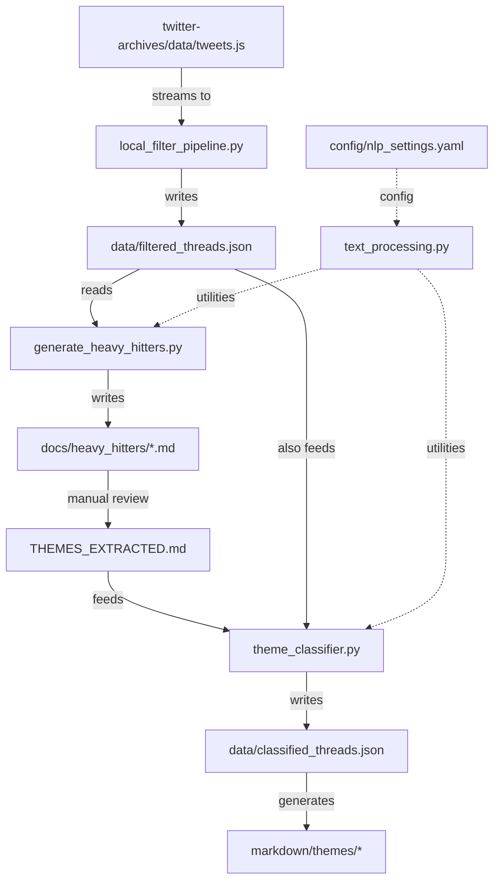

# DremelDocs Cross-Reference Guide

## 🔗 Component Relationships

### Data Flow Dependencies



---

## 📦 Module Interactions

### Core Module Dependencies

| Module | Depends On | Used By | Key Functions |
|--------|------------|---------|---------------|
| `text_processing.py` | spacy, dateutil | generate_heavy_hitters.py, theme_classifier.py | clean_text(), extract_title() |
| `local_filter_pipeline.py` | ijson, json | standalone (entry point) | stream_tweets(), extract_threads() |
| `generate_heavy_hitters.py` | text_processing.py | standalone (step 2) | process_thread(), generate_markdown() |
| `theme_classifier.py` | text_processing.py, AI libs | standalone (step 3) | classify_thread(), apply_themes() |

### Test Coverage Map

```
scripts/text_processing.py
    └── tests/unit/test_text_processing.py (71% coverage)

scripts/generate_heavy_hitters.py
    └── tests/unit/test_generate_heavy_hitters.py (89% coverage)

scripts/local_filter_pipeline.py
    └── tests/integration/test_filter_pipeline.py (21% coverage)

Full Pipeline
    └── tests/integration/test_end_to_end.py
```

---

## 📄 Documentation Cross-References

### By Purpose

| Need | Primary Doc | Supporting Docs | Related Code |
|------|------------|-----------------|--------------|
| Project Overview | README.md | PROJECT_INDEX.md, STATUS.md | - |
| Technical Design | ARCHITECTURE.md | API.md | All scripts/ |
| Development Guide | workflow.md | setup.md | - |
| Testing | testing.md | TESTING_FRAMEWORK_SUMMARY.md | tests/ |
| Navigation | PROJECT_INDEX.md | NAVIGATION.md, INDEX.md | - |
| Current State | STATUS.md | .notes/CLEANUP_SUMMARY.md | - |

### By Audience

#### For Users
- Start: `README.md` → `workflow.md`
- Review: `docs/heavy_hitters/index.md` → Individual files
- Extract: `THEME_TEMPLATE.md` → Create `THEMES_EXTRACTED.md`

#### For Developers
- Architecture: `ARCHITECTURE.md` → `API.md`
- Testing: `testing.md` → `tests/`
- Scripts: `scripts/` → `docs/API.md`

#### For Claude Code
- Instructions: `CLAUDE.md`
- Knowledge: `.serena/memories/PROJECT_KNOWLEDGE_BASE`
- Best Practices: `.notes/SERENA_MEMORY_BEST_PRACTICES.md`

---

## 🔄 Configuration Relationships

### Configuration Files and Their Consumers

```
pyproject.toml
    ├── Defines dependencies for all Python scripts
    ├── Configures pytest settings
    └── Sets up uv environment

mkdocs.yml
    ├── Configures Material theme
    ├── Defines navigation structure
    └── Sets up plugins and extensions

config/nlp_settings.yaml
    ├── Domain vocabulary for text_processing.py
    ├── SpaCy model configuration
    └── Tag extraction parameters

.gitignore
    ├── Excludes data/ directory
    ├── Ignores Python caches
    └── Protects sensitive files
```

---

## 🎯 Functional Cross-References

### Thread Processing Chain

1. **Extraction Phase**
   - Source: `twitter-archives/data/tweets.js`
   - Processor: `local_filter_pipeline.py::stream_tweets()`
   - Output: Raw tweet stream

2. **Filtering Phase**
   - Input: Tweet stream
   - Processor: `local_filter_pipeline.py::filter_tweets()`
   - Criteria: Length > 100 chars
   - Output: Filtered tweets

3. **Thread Detection**
   - Input: Filtered tweets
   - Processor: `local_filter_pipeline.py::extract_threads()`
   - Logic: Reply chain reconstruction
   - Output: `data/filtered_threads.json`

4. **Heavy Hitter Extraction**
   - Input: `data/filtered_threads.json`
   - Processor: `generate_heavy_hitters.py::main()`
   - Criteria: 500+ words
   - Output: `docs/heavy_hitters/*.md`

5. **Theme Classification**
   - Input: User themes + filtered threads
   - Processor: `theme_classifier.py::classify_threads()`
   - Output: `data/classified_threads.json`

---

## 🗂️ Memory and Notes Cross-References

### Serena Memories
| Memory | Purpose | Related Files |
|--------|---------|---------------|
| PROJECT_KNOWLEDGE_BASE | Complete reference | All project files |
| technical_learnings_spacy_uv | SpaCy setup guide | text_processing.py |
| project_nlp_infrastructure | NLP configuration | config/nlp_settings.yaml |
| code_style_conventions | Coding standards | All Python files |
| suggested_commands | Quick reference | Scripts and tests |
| git_setup_configuration | Version control | .gitignore, .gitattributes |

### Historical Notes
| Note | Content | Original Memory |
|------|---------|-----------------|
| consolidated_sessions.md | Development timeline | session_* memories |
| CLEANUP_SUMMARY.md | Memory reorganization | N/A |
| SERENA_MEMORY_BEST_PRACTICES.md | Memory management guide | N/A |

---

## 🔍 Search Patterns

### Find Related Components

```bash
# Find all files that reference theme classification
grep -r "theme" --include="*.py" --include="*.md"

# Find all test files for a script
find tests -name "*heavy_hitters*"

# Find all markdown documentation
find . -name "*.md" -not -path "./twitter-archives/*"

# Find configuration files
find . -name "*.yaml" -o -name "*.yml" -o -name "*.toml"
```

### Trace Data Flow

```bash
# Track filtered_threads.json usage
grep -r "filtered_threads.json" scripts/

# Find heavy hitter references
grep -r "heavy_hitter" --include="*.py"

# Trace theme extraction
grep -r "THEME" docs/heavy_hitters/
```

---

## 📊 Statistics Cross-Reference

### Input/Output Metrics
| Stage | Input | Output | Reduction |
|-------|-------|--------|-----------|
| Raw Archive | 1.9GB (83 files) | tweets.js (37MB) | 98% |
| Tweet Extraction | 37MB | 21,723 tweets | - |
| Length Filter | 21,723 tweets | 10,396 tweets | 52% |
| Thread Detection | 10,396 tweets | 1,363 threads | 87% |
| Heavy Hitters | 1,363 threads | 59 documents | 96% |
| **Total Reduction** | 21,723 tweets | 59 documents | **99.7%** |

### Code Metrics
| Component | Lines | Tests | Coverage |
|-----------|-------|-------|----------|
| text_processing.py | ~300 | 15 | 71% |
| generate_heavy_hitters.py | ~250 | 12 | 89% |
| local_filter_pipeline.py | ~200 | 8 | 21% |
| theme_classifier.py | ~180 | 0 | 0% |
| **Total** | ~930 | 119 | ~60% avg |

---

## 🚀 Quick Jump Links

### Critical Paths
- Pipeline entry: [`scripts/local_filter_pipeline.py`](../scripts/local_filter_pipeline.py)
- Heavy hitter generation: [`scripts/generate_heavy_hitters.py`](../scripts/generate_heavy_hitters.py)
- Theme template: [`docs/heavy_hitters/THEME_TEMPLATE.md`](heavy_hitters/THEME_TEMPLATE.md)
- Test suite: [`tests/`](../tests/)

### Key Documentation
- Full index: [`PROJECT_INDEX.md`](../PROJECT_INDEX.md)
- Architecture: [`ARCHITECTURE.md`](ARCHITECTURE.md)
- Current status: [`STATUS.md`](STATUS.md)
- API reference: [`API.md`](API.md)

---

*Cross-Reference Guide v1.0 | Generated: 2025-01-23*