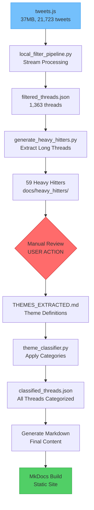

# 📚 AstraDocs Master Documentation Index

> Complete documentation map with cross-references, navigation, and resource organization for the AstraDocs Twitter Archive Processing Pipeline

## 🎯 Quick Navigation

### Essential Documents
| Document | Purpose | Location |
|----------|---------|----------|
| **Project Overview** | High-level project introduction | [`README.md`](../README.md) |
| **Current Status** | Live project state tracking | [`docs/STATUS.md`](STATUS.md) |
| **Quick Index** | Original navigation | [`docs/INDEX.md`](INDEX.md) |
| **Architecture** | Technical design details | [`docs/ARCHITECTURE.md`](ARCHITECTURE.md) |
| **Workflow Guide** | Step-by-step process | [`docs/workflow.md`](workflow.md) |

### Quick Actions
- 🚀 [Start Here](#getting-started) - New to the project
- 📊 [View Pipeline](#pipeline-documentation) - Processing stages
- 🔧 [Run Scripts](#scripts-reference) - Execute pipeline
- 📝 [Read Heavy Hitters](#heavy-hitters-collection) - Theme extraction
- 🧪 [Run Tests](#testing-documentation) - Quality assurance

## 📂 Complete Documentation Structure

### 1️⃣ Project Root Documentation

#### Core Configuration
- [`README.md`](../README.md) - Project overview and quick start guide
- [`CLAUDE.md`](../CLAUDE.md) - AI assistant instructions
- [`pyproject.toml`](../pyproject.toml) - Project metadata and dependencies
- [`mkdocs.yml`](../mkdocs.yml) - MkDocs site configuration
- [`GIT_WORKFLOW.md`](../GIT_WORKFLOW.md) - Version control practices

#### Environment Setup
- [`requirements.txt`](../requirements.txt) - Core dependencies
- [`requirements-dev.txt`](../requirements-dev.txt) - Development dependencies
- [`.env.example`](../.env.example) - Environment variable template
- [`pytest.ini`](../pytest.ini) - Test configuration

### 2️⃣ Main Documentation (`/docs`)

#### Project Management
- [`INDEX.md`](INDEX.md) - Original project index and navigation
- [`STATUS.md`](STATUS.md) - Current project state and blockers
- [`MASTER_INDEX.md`](MASTER_INDEX.md) - This comprehensive index

#### Technical Documentation
- [`ARCHITECTURE.md`](ARCHITECTURE.md) - System design and technical architecture
- [`API.md`](API.md) - Script and function reference
- [`workflow.md`](workflow.md) - Complete processing workflow guide
- [`setup.md`](setup.md) - Installation and configuration

#### Testing Documentation
- [`testing.md`](testing.md) - Test execution guide
- [`TESTING_FRAMEWORK_SUMMARY.md`](TESTING_FRAMEWORK_SUMMARY.md) - Test architecture overview
- [`tests/README.md`](../tests/README.md) - Test suite documentation
- [`tests/TESTING_GUIDE.md`](../tests/TESTING_GUIDE.md) - Testing best practices
- [`tests/TEST_DOCUMENTATION.md`](../tests/TEST_DOCUMENTATION.md) - Test coverage details

### 3️⃣ Pipeline Documentation (`/docs/pipeline`)

Sequential processing stages documentation:

1. [`00-quick-start.md`](pipeline/00-quick-start.md) - Pipeline quick reference
2. [`01-data-structure-analysis.md`](pipeline/01-data-structure-analysis.md) - Twitter archive structure
3. [`02-extraction-pipeline.md`](pipeline/02-extraction-pipeline.md) - Data extraction process
4. [`03-thread-detection-strategy.md`](pipeline/03-thread-detection-strategy.md) - Thread reconstruction logic
5. [`04-classification-approach.md`](pipeline/04-classification-approach.md) - Content categorization
6. [`05-implementation-plan.md`](pipeline/05-implementation-plan.md) - Development roadmap
7. [`06-technical-specifications.md`](pipeline/06-technical-specifications.md) - Detailed specs

### 4️⃣ Heavy Hitters Collection (`/docs/heavy_hitters`)

59 substantial threads (500+ words) for theme extraction:

#### Index and Template
- [`index.md`](heavy_hitters/index.md) - Heavy hitters overview
- [`THEME_TEMPLATE.md`](heavy_hitters/THEME_TEMPLATE.md) - Theme extraction template

#### Notable Threads (Top 10 by Impact)
1. [`001-the_lake_quonnipaug_conference.md`](heavy_hitters/001-20240906-the_lake_quonnipaug_conference.md) - Historical analysis
2. [`003-prisons_are_a_way_to_extract_slave_labor.md`](heavy_hitters/003-20241009-prisons_are_a_way_to_extract_slave_labor.md) - Prison labor critique
3. [`013-misunderstanding_around_fascism.md`](heavy_hitters/013-20240911-m_seeing_a_lot_of_misunderstanding_around_fascism.md) - Fascism analysis
4. [`015-covid_variant_jn1.md`](heavy_hitters/015-20240104-janus_what_covid_variant_jn1_means_for_you.md) - COVID analysis
5. [`029-gays_did_nt_win.md`](heavy_hitters/029-20230919-gays_did_nt_win.md) - LGBTQ rights
6. [`038-china_is_imperialist_too.md`](heavy_hitters/038-20240928-china_is_imperialist_too.md) - Geopolitics
7. [`043-settler_colonialism.md`](heavy_hitters/043-20240423-settler_colonialism.md) - Colonial critique
8. [`051-left_antisemitism.md`](heavy_hitters/051-20250622-left_antisemitism.md) - Political analysis
9. [`053-pandemic_erasure_campaign.md`](heavy_hitters/053-20240201-the_pandemic_erasure_campaign.md) - COVID politics
10. [`059-effective_altruism.md`](heavy_hitters/059-20250413-effective_altruism.md) - EA critique

[View all 59 threads →](heavy_hitters/)

### 5️⃣ Archive Documentation (`/archive`)

#### Historical Reports (`/archive/reports`)
- [`PROJECT_STATE.md`](../archive/reports/PROJECT_STATE.md) - Historical project state
- [`SESSION_MEMORY.md`](../archive/reports/SESSION_MEMORY.md) - Development session logs
- [`MCP_SERVER_STATUS.md`](../archive/reports/MCP_SERVER_STATUS.md) - Tool status reports
- [`PIPELINE_ANALYSIS_REPORT.md`](../archive/reports/PIPELINE_ANALYSIS_REPORT.md) - Pipeline analysis
- [`ULTRA_ANALYSIS_TWITTER_ARCHIVE.md`](../archive/reports/ULTRA_ANALYSIS_TWITTER_ARCHIVE.md) - Deep archive analysis

#### Legacy Documentation (`/archive/legacy`)
- [`twitter-to-mkdocs-project.md`](../archive/legacy/twitter-to-mkdocs-project.md) - Original project plan

### 6️⃣ MkDocs Content (`/markdown`)

#### Site Structure
- [`index.md`](../markdown/index.md) - Homepage with dedication
- [`about/ai-collaboration.md`](../markdown/about/ai-collaboration.md) - AI ethics for leftists
- [`stylesheets/extra.css`](../markdown/stylesheets/) - Custom styling

### 7️⃣ Sample Output (`/data/sample_threads`)

Example processed threads:
- [`Wed Oct 09_I_too_once_fell_into_the_trap_.md`](../data/sample_threads/Wed%20Oct%2009_I_too_once_fell_into_the_trap_.md)
- [`Sat Feb 10_Its_not_a_lack_of_discipline_t.md`](../data/sample_threads/Sat%20Feb%2010_Its_not_a_lack_of_discipline_t.md)
- [`Sat Dec 02_A_pernicious_mythology_that_ha.md`](../data/sample_threads/Sat%20Dec%2002_A_pernicious_mythology_that_ha.md)

## 🔧 Scripts Reference

### Core Pipeline Scripts

#### `local_filter_pipeline.py`
**Purpose**: Main filtering engine
**Location**: [`scripts/local_filter_pipeline.py`](../scripts/local_filter_pipeline.py)
**Key Features**:
- Stream processing with ijson
- 2-stage filtering (length + thread detection)
- Memory-efficient processing (<100MB)

```python
# Usage
from scripts.local_filter_pipeline import LocalThreadExtractor
extractor = LocalThreadExtractor("source")
extractor.run_pipeline()
```

#### `generate_heavy_hitters.py`
**Purpose**: Extract substantial threads
**Location**: [`scripts/generate_heavy_hitters.py`](../scripts/generate_heavy_hitters.py)
**Output**: 59 markdown files in `docs/heavy_hitters/`

#### `theme_classifier.py`
**Purpose**: Apply themes to all threads
**Location**: [`scripts/theme_classifier.py`](../scripts/theme_classifier.py)
**Status**: Awaiting theme extraction

## 📊 Project Metrics Dashboard

### Processing Statistics
| Metric | Value | Notes |
|--------|-------|-------|
| **Input Size** | 37MB | Raw tweets.js file |
| **Total Tweets** | 21,723 | Complete archive |
| **Filtered Threads** | 1,363 | 6.3% retention rate |
| **Heavy Hitters** | 59 | 500+ word threads |
| **Total Words** | ~200,000 | In heavy hitters |
| **Processing Time** | ~2 min | Full pipeline |
| **Memory Usage** | <100MB | Peak usage |
| **Cost Savings** | $108 | vs API approach |

### Content Categories (Pending Classification)
- 🧠 **Philosophy**: TBD
- 🏛️ **Politics**: TBD
- 🔄 **Both**: TBD
- 🎨 **Custom Themes**: User-defined

## 🗺️ Workflow Map



## 🚀 Getting Started

### For New Users
1. **Read** [`README.md`](../README.md) for project overview
2. **Setup** environment using [`setup.md`](setup.md)
3. **Review** [`workflow.md`](workflow.md) for process understanding
4. **Check** [`STATUS.md`](STATUS.md) for current state

### For Theme Extraction (Current Task)
1. **Navigate** to [`docs/heavy_hitters/`](heavy_hitters/)
2. **Read** 59 markdown files (1-2 hours)
3. **Use** [`THEME_TEMPLATE.md`](heavy_hitters/THEME_TEMPLATE.md)
4. **Save** as `THEMES_EXTRACTED.md` in project root

### For Developers
1. **Study** [`ARCHITECTURE.md`](ARCHITECTURE.md) for system design
2. **Review** [`API.md`](API.md) for function reference
3. **Run** tests using [`testing.md`](testing.md)
4. **Follow** [`GIT_WORKFLOW.md`](../GIT_WORKFLOW.md) for contributions

## 🔗 Cross-References

### By Topic
- **Pipeline Details**: [Pipeline Docs](pipeline/) → [Architecture](ARCHITECTURE.md) → [API](API.md)
- **Testing**: [Testing Guide](testing.md) → [Test Framework](TESTING_FRAMEWORK_SUMMARY.md) → [Test Docs](../tests/)
- **Content**: [Heavy Hitters](heavy_hitters/) → [Sample Threads](../data/sample_threads/) → [Markdown Output](../markdown/)
- **Configuration**: [pyproject.toml](../pyproject.toml) → [mkdocs.yml](../mkdocs.yml) → [Environment](.env.example)

### By Workflow Stage
1. **Setup**: [setup.md](setup.md) → [requirements.txt](../requirements.txt)
2. **Extract**: [local_filter_pipeline.py](../scripts/local_filter_pipeline.py) → [filtered_threads.json](../data/filtered_threads.json)
3. **Analyze**: [heavy_hitters/](heavy_hitters/) → [THEME_TEMPLATE.md](heavy_hitters/THEME_TEMPLATE.md)
4. **Classify**: [theme_classifier.py](../scripts/theme_classifier.py) → [classified_threads.json]
5. **Generate**: [markdown/](../markdown/) → [mkdocs.yml](../mkdocs.yml)
6. **Deploy**: `mkdocs build` → `site/`

## 📈 Progress Tracker

### ✅ Completed (85%)
- [x] Project structure refactoring
- [x] Dependency optimization (75% reduction)
- [x] Local filtering pipeline
- [x] Heavy hitter generation
- [x] Documentation structure
- [x] MkDocs configuration
- [x] Website theme design

### 🔄 Current Blocker
- [ ] **Theme Extraction** - Manual review required (USER ACTION)

### ⏳ Pending (15%)
- [ ] Thread classification (automated after themes)
- [ ] Markdown generation (automated)
- [ ] MkDocs deployment (automated)

## 🛠️ Maintenance

### Documentation Updates
- This index: Update when adding new documentation
- [`STATUS.md`](STATUS.md): Update after each work session
- [`SESSION_MEMORY.md`](../archive/reports/SESSION_MEMORY.md): Archive session notes

### Version Control
- Follow [`GIT_WORKFLOW.md`](../GIT_WORKFLOW.md)
- Commit message format: `type: description`
- Branch naming: `feature/description` or `fix/description`

---

*Generated: September 23, 2025*
*Project: AstraDocs - Twitter Archive to MkDocs Pipeline*
*Status: 85% Complete - Awaiting Theme Extraction*