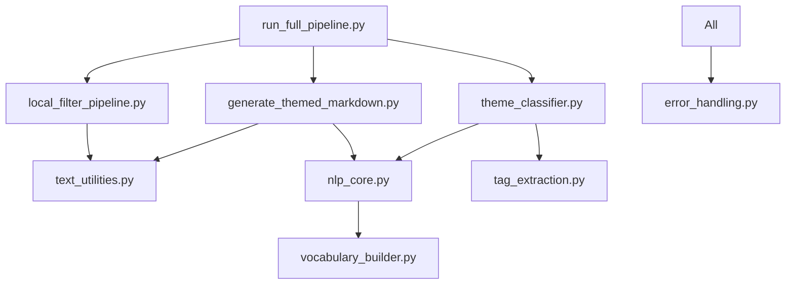

# DremelDocs Navigation Index

## 🧭 Quick Navigation

### By Purpose
- **[Start Here](#getting-started)** → Setup and quickstart guides
- **[Understand](#architecture--design)** → System architecture and design
- **[Build](#development)** → Development workflow and tools
- **[Test](#testing)** → Testing strategies and coverage
- **[Deploy](#deployment)** → Building and deployment
- **[Reference](#api--reference)** → API documentation and references

### By User Type
- **[New Developer](#new-developer-path)** → First-time setup
- **[Contributor](#contributor-path)** → Contributing guidelines
- **[Maintainer](#maintainer-path)** → Project maintenance
- **[End User](#end-user-path)** → Using the generated site

---

## 📁 Complete File Map

### Root Directory
```
/home/percy/projects/dremeldocs/
├── PROJECT_INDEX.md          → [Master navigation hub](#master-index)
├── README.md                 → [Project overview](#readme)
├── CLAUDE.md                 → [AI assistant guide](#claude-guide)
├── Makefile                  → [Task automation](#makefile-commands)
├── pyproject.toml           → [Python config](#python-configuration)
└── mkdocs.yml               → [Site config](#mkdocs-configuration)
```

### Documentation (`docs/`)
```
docs/
├── INDEX.md                 → [Documentation home](#documentation-home)
├── ARCHITECTURE.md          → [System design](#architecture)
├── API.md                   → [API reference](#api-reference)
├── API_REFERENCE.md         → [Detailed API docs](#detailed-api)
├── NAVIGATION_INDEX.md      → This file
├── STATUS.md                → [Project status](#project-status)
├── workflow.md              → [Dev workflow](#development-workflow)
├── setup.md                 → [Environment setup](#setup-guide)
├── testing.md               → [Testing guide](#testing-framework)
└── heavy_hitters/
    ├── index.md             → [Heavy hitter nav](#heavy-hitters)
    ├── THEME_TEMPLATE.md    → [Theme extraction](#theme-extraction)
    └── [59 thread files]    → [Long threads](#thread-documents)
```

### Configuration (`config/`)
```
config/
├── CONFIGURATION_ARCHITECTURE.md → [Config design](#configuration-architecture)
├── DEVELOPER_ENVIRONMENT.md     → [Dev environment](#developer-environment)
├── DEVELOPER_QUICKSTART.md      → [Quick setup](#quickstart)
├── QUICK_START.md               → [User quickstart](#user-quickstart)
├── pipeline.yml                 → [Pipeline config](#pipeline-configuration)
├── nlp_settings.yaml           → [NLP settings](#nlp-configuration)
├── environments/
│   ├── dev.yml                 → [Dev config](#environment-configs)
│   └── prod.yml                → [Prod config](#environment-configs)
└── vocabulary/                  → [Domain vocabularies](#vocabularies)
```

### Scripts (`scripts/`)
```
scripts/
├── local_filter_pipeline.py     → [Thread extraction](#thread-extraction)
├── generate_themed_markdown.py  → [Markdown generation](#markdown-generation)
├── theme_classifier.py         → [Classification](#theme-classification)
├── run_full_pipeline.py        → [Orchestration](#pipeline-orchestration)
├── nlp_core.py                 → [NLP utilities](#nlp-core)
├── text_utilities.py           → [Text processing](#text-utilities)
├── tag_extraction.py           → [Tag extraction](#tag-extraction)
├── error_handling.py           → [Error handling](#error-handling)
├── vocabulary_builder.py       → [Vocabulary building](#vocabulary-builder)
└── archived_experiments/       → [Historical code](#archived-experiments)
```

### Tests (`tests/`)
```
tests/
├── README.md                   → [Test overview](#test-readme)
├── TESTING_GUIDE.md           → [Testing patterns](#testing-guide)
├── TEST_DOCUMENTATION.md      → [Test docs](#test-documentation)
├── COVERAGE_REPORT.md         → [Coverage report](#coverage-report)
├── conftest.py                → [Test config](#test-configuration)
├── unit/                      → [Unit tests](#unit-tests)
├── integration/               → [Integration tests](#integration-tests)
├── scripts/                   → [Script tests](#script-tests)
└── fixtures/                  → [Test data](#test-fixtures)
```

### MkDocs Content (`markdown/`)
```
markdown/
├── index.md                   → [Site homepage](#site-homepage)
├── about/
│   ├── index.md              → [About section](#about-section)
│   ├── usage.md              → [Usage guide](#usage-guide)
│   └── ai-collaboration.md   → [AI ethics](#ai-collaboration)
├── themes/
│   ├── index.md              → [Themes home](#themes-section)
│   └── [Generated content]    → [Classified threads](#classified-content)
├── analysis/
│   └── index.md              → [Analysis section](#analysis-section)
└── stylesheets/
    └── extra.css             → [Custom styles](#custom-styles)
```

---

## 🔗 Cross-Reference Matrix

### Core Workflows

| Task | Primary Doc | Supporting Docs | Scripts | Tests |
|------|------------|-----------------|---------|-------|
| **Setup Project** | [DEVELOPER_QUICKSTART.md](#quickstart) | [setup.md](#setup-guide), [README.md](#readme) | - | - |
| **Extract Threads** | [workflow.md](#development-workflow) | [API.md](#api-reference) | `local_filter_pipeline.py` | `test_filter_pipeline.py` |
| **Generate Heavy Hitters** | [ARCHITECTURE.md](#architecture) | [API_REFERENCE.md](#detailed-api) | `generate_themed_markdown.py` | `test_generate_heavy_hitters.py` |
| **Classify Themes** | [workflow.md](#development-workflow) | [THEME_TEMPLATE.md](#theme-extraction) | `theme_classifier.py` | `test_theme_classifier.py` |
| **Build Site** | [mkdocs.yml](#mkdocs-configuration) | [QUICK_START.md](#user-quickstart) | - | - |
| **Run Tests** | [TESTING_GUIDE.md](#testing-guide) | [conftest.py](#test-configuration) | - | All test files |

### Module Dependencies



---

## 📚 Document Categories

### Getting Started
- [README.md](../README.md) - Project overview and quick start
- [DEVELOPER_QUICKSTART.md](../config/DEVELOPER_QUICKSTART.md) - Fast setup for developers
- [QUICK_START.md](../config/QUICK_START.md) - User guide for running pipeline
- [setup.md](setup.md) - Detailed environment setup

### Architecture & Design
- [ARCHITECTURE.md](ARCHITECTURE.md) - System design and data flow
- [CONFIGURATION_ARCHITECTURE.md](../config/CONFIGURATION_ARCHITECTURE.md) - Config management design
- [PROJECT_INDEX.md](../PROJECT_INDEX.md) - Comprehensive project overview

### Development
- [workflow.md](workflow.md) - Development workflow and practices
- [DEVELOPER_ENVIRONMENT.md](../config/DEVELOPER_ENVIRONMENT.md) - Dev environment configuration
- [CLAUDE.md](../CLAUDE.md) - AI assistant integration guide

### Testing
- [TESTING_GUIDE.md](../tests/TESTING_GUIDE.md) - Testing patterns and strategies
- [TEST_DOCUMENTATION.md](../tests/TEST_DOCUMENTATION.md) - Test suite documentation
- [COVERAGE_REPORT.md](../tests/COVERAGE_REPORT.md) - Test coverage analysis
- [testing.md](testing.md) - Testing framework overview

### API & Reference
- [API.md](API.md) - High-level API overview
- [API_REFERENCE.md](API_REFERENCE.md) - Detailed API documentation
- [STATUS.md](STATUS.md) - Current project status

### Deployment
- [mkdocs.yml](../mkdocs.yml) - MkDocs site configuration
- [Makefile](../Makefile) - Build and deployment commands

---

## 🚀 Quick Paths

### New Developer Path
1. Start: [DEVELOPER_QUICKSTART.md](../config/DEVELOPER_QUICKSTART.md)
2. Setup: [setup.md](setup.md)
3. Understand: [ARCHITECTURE.md](ARCHITECTURE.md)
4. Code: [API_REFERENCE.md](API_REFERENCE.md)
5. Test: [TESTING_GUIDE.md](../tests/TESTING_GUIDE.md)

### Contributor Path
1. Overview: [README.md](../README.md)
2. Workflow: [workflow.md](workflow.md)
3. API: [API.md](API.md)
4. Testing: [testing.md](testing.md)

### Maintainer Path
1. Status: [STATUS.md](STATUS.md)
2. Architecture: [CONFIGURATION_ARCHITECTURE.md](../config/CONFIGURATION_ARCHITECTURE.md)
3. Pipeline: [pipeline.yml](../config/pipeline.yml)
4. Deployment: [Makefile](../Makefile)

### End User Path
1. Quick Start: [QUICK_START.md](../config/QUICK_START.md)
2. Heavy Hitters: [docs/heavy_hitters/index.md](heavy_hitters/index.md)
3. Theme Template: [THEME_TEMPLATE.md](heavy_hitters/THEME_TEMPLATE.md)
4. View Site: `mkdocs serve`

---

## 📋 Makefile Commands

Quick reference for available make commands:

```bash
# Core Pipeline
make pipeline        # Run complete pipeline
make extract        # Extract threads from archive
make heavy-hitters  # Generate heavy hitter docs
make classify       # Classify threads (requires themes)

# Development
make test          # Run test suite
make lint          # Check code quality
make format        # Auto-format code
make clean         # Clean generated files

# Documentation
make docs-serve    # Serve MkDocs locally
make docs-build    # Build static site
make docs-deploy   # Deploy to GitHub Pages

# Utilities
make help          # Show all commands
make install       # Install dependencies
make spacy-model   # Install SpaCy model
```

---

## 🔍 Search Keywords

### By Technology
- **Python**: pyproject.toml, scripts/, tests/, requirements.txt
- **SpaCy**: nlp_core.py, nlp_settings.yaml, en_core_web_lg
- **MkDocs**: mkdocs.yml, markdown/, themes
- **Testing**: pytest, conftest.py, coverage

### By Domain
- **Philosophy**: heavy_hitters/, themes/, political
- **NLP**: tag_extraction, vocabulary, chunking
- **Pipeline**: filter, classify, generate
- **Configuration**: config/, yaml, environments

### By Action
- **Setup**: install, quickstart, environment
- **Run**: pipeline, execute, process
- **Test**: pytest, coverage, unit, integration
- **Build**: mkdocs, generate, markdown
- **Deploy**: build, serve, gh-pages

---

## 📝 Notes

- All paths are relative to project root unless specified
- Cross-references use anchors for direct navigation
- Documentation follows consistent naming patterns
- Scripts have corresponding test files in tests/
- Configuration is centralized in config/ directory

---

*Navigation Index v1.0 | Generated: 2025-09-23*