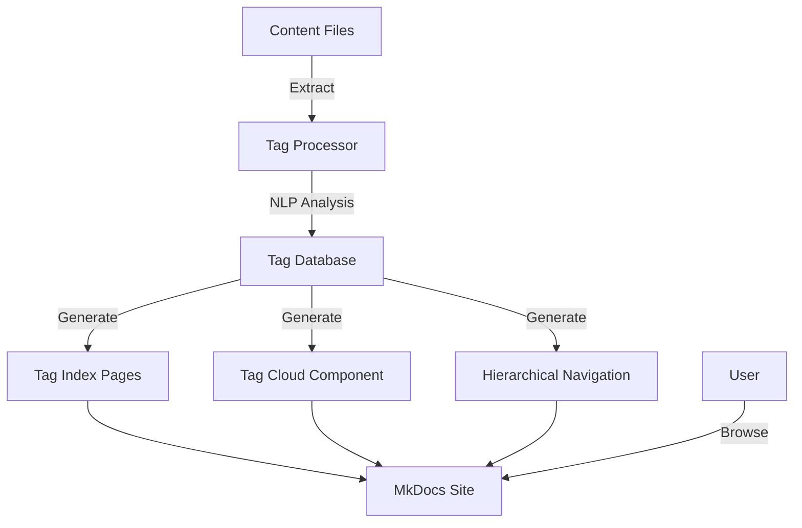

# Tag-Based Navigation Design for DremelDocs

## Executive Summary

This design implements a comprehensive tag-based navigation system for the DremelDocs MkDocs site, enabling users to discover content through thematic tags, hierarchical categorization, and visual navigation components.

## Architecture Overview



## Component Design

### 1. MkDocs Material Configuration

**File**: `mkdocs.yml`

```yaml
# Site metadata
site_name: DremelDocs Revolutionary Theory Archive
site_url: https://dremeldocs.org
site_author: BmoreOrganized
site_description: >-
  A curated archive of revolutionary theory, political analysis,
  and critical discourse from over a decade of philosophical inquiry.

# Repository
repo_url: https://github.com/percy-raskova/dremeldocs
repo_name: dremeldocs

# Theme configuration
theme:
  name: material
  custom_dir: overrides
  language: en

  # Color scheme
  palette:
    - scheme: default
      primary: deep purple
      accent: amber
      toggle:
        icon: material/brightness-7
        name: Switch to dark mode
    - scheme: slate
      primary: deep purple
      accent: amber
      toggle:
        icon: material/brightness-4
        name: Switch to light mode

  # Typography
  font:
    text: Roboto
    code: Roboto Mono

  # Features
  features:
    - navigation.instant
    - navigation.tracking
    - navigation.tabs
    - navigation.tabs.sticky
    - navigation.sections
    - navigation.expand
    - navigation.path
    - navigation.top
    - search.suggest
    - search.highlight
    - search.share
    - content.code.copy
    - content.code.annotate
    - toc.follow
    - toc.integrate

  # Icons
  icon:
    logo: material/library
    repo: fontawesome/brands/github
    tag:
      default: material/tag
      marxism: material/hammer-sickle
      philosophy: material/thought-bubble
      politics: material/gavel
      economics: material/cash
      history: material/history
      culture: material/palette
      science: material/atom
      technology: material/chip

# Plugins
plugins:
  - search:
      separator: '[\s\-,:!=\[\]()"`/]+|\.(?!\d)|&[lg]t;|(?!\b)(?=[A-Z][a-z])'
      lang:
        - en

  - tags:
      enabled: true
      tags_file: tags/index.md
      tags_hierarchy: true
      tags_hierarchy_separator: "/"
      tags_slugify_separator: "-"
      tags_slugify_format: "tag:{slug}"

      # Shadow tags for internal organization
      shadow_tags:
        - Draft
        - Archive
        - Internal

      # Listings configuration
      listings_map:
        by-category:
          scope: false
          toc: true
        by-theme:
          scope: true
          exclude: [Draft, Internal]

      # Allowed tags for consistency
      tags_allowed:
        # Political Theory
        - marxism
        - socialism
        - communism
        - anarchism
        - capitalism/critique
        - imperialism
        - colonialism
        - neoliberalism

        # Philosophy
        - dialectics
        - materialism
        - idealism
        - phenomenology
        - existentialism
        - critical-theory
        - postmodernism

        # Social Issues
        - class-struggle
        - labor
        - unions
        - gender
        - race
        - intersectionality
        - lgbtq
        - disability

        # Science & Technology
        - climate
        - ecology
        - technology/critique
        - artificial-intelligence
        - surveillance
        - data-politics

        # Culture
        - art
        - literature
        - film
        - music
        - media-criticism

        # Historical
        - historical-materialism
        - revolution
        - resistance
        - solidarity
        - organizing

  - social:
      cards_layout: default
      cards_layout_options:
        background_color: "#4051b5"

  - minify:
      minify_html: true
      minify_js: true
      minify_css: true
      htmlmin_opts:
        remove_comments: true

# Extensions
markdown_extensions:
  - pymdownx.arithmatex:
      generic: true
  - pymdownx.betterem
  - pymdownx.caret
  - pymdownx.mark
  - pymdownx.tilde
  - pymdownx.critic
  - pymdownx.details
  - pymdownx.emoji:
      emoji_index: !!python/name:material.extensions.emoji.twemoji
      emoji_generator: !!python/name:material.extensions.emoji.to_svg
  - pymdownx.highlight:
      anchor_linenums: true
  - pymdownx.inlinehilite
  - pymdownx.keys
  - pymdownx.magiclink
  - pymdownx.smartsymbols
  - pymdownx.snippets
  - pymdownx.superfences:
      custom_fences:
        - name: mermaid
          class: mermaid
          format: !!python/name:pymdownx.superfences.fence_code_format
  - pymdownx.tabbed:
      alternate_style: true
  - pymdownx.tasklist:
      custom_checkbox: true
  - admonition
  - abbr
  - attr_list
  - def_list
  - footnotes
  - meta
  - md_in_html
  - toc:
      permalink: true
      toc_depth: 3

# Navigation
nav:
  - Home: index.md
  - About:
    - About This Archive: about/index.md
    - Usage Guide: about/usage.md
    - AI Collaboration: about/ai-collaboration.md

  - Browse by Tags:
    - Tag Index: tags/index.md
    - Tag Cloud: tags/cloud.md
    - Categories: tags/categories.md
    - Hierarchy: tags/hierarchy.md

  - Themes:
    - Revolutionary Theory: themes/index.md
    - Marxism & Historical Materialism: marxism_historical materialism/index.md
    - Political Economy: political economy/index.md
    - Imperialism & Colonialism: imperialism_colonialism/index.md
    - Cultural Criticism: cultural criticism/index.md
    - Dialectics: dialectics/index.md
    - COVID & Public Health Politics: covid_public health politics/index.md
    - Organizational Theory: organizational theory/index.md
    - Fascism Analysis: fascism analysis/index.md
    - Intersectional Analysis: intersectional/index.md
    - Politics: politics/index.md

  - Analysis:
    - Critical Analysis: analysis/index.md

  - Resources:
    - Search: search.md
    - Archive: archive.md
    - Statistics: stats.md

# Extra configuration
extra:
  social:
    - icon: fontawesome/brands/github
      link: https://github.com/percy-raskova
    - icon: fontawesome/brands/twitter
      link: https://twitter.com/BmoreOrganized

  tags:
    # Tag categories for organization
    categories:
      theory:
        label: "Political Theory"
        icon: material/book-education
        tags: [marxism, socialism, communism, anarchism]
      philosophy:
        label: "Philosophy"
        icon: material/thought-bubble
        tags: [dialectics, materialism, critical-theory]
      social:
        label: "Social Issues"
        icon: material/account-group
        tags: [class-struggle, gender, race, intersectionality]
      science:
        label: "Science & Tech"
        icon: material/atom
        tags: [climate, ecology, technology/critique, artificial-intelligence]

extra_css:
  - stylesheets/extra.css
  - stylesheets/tags.css

extra_javascript:
  - javascripts/tags.js
```

### 2. Tag Extraction Pipeline

**File**: `scripts/tag_extractor.py`

```python
"""
Tag extraction pipeline for DremelDocs content.
Leverages existing NLP infrastructure to extract and categorize tags.
"""

import json
import yaml
from pathlib import Path
from typing import Dict, List, Set, Tuple
from dataclasses import dataclass, field
from collections import Counter, defaultdict
import logging

from nlp_core import EnhancedTagExtractor
from text_utilities import clean_text
from vocabulary_builder import VocabularyBuilder

logger = logging.getLogger(__name__)


@dataclass
class TagMetadata:
    """Metadata for a single tag."""
    name: str
    slug: str
    category: str = ""
    count: int = 0
    related_tags: Set[str] = field(default_factory=set)
    documents: List[str] = field(default_factory=list)
    weight: float = 1.0  # For tag cloud visualization
    hierarchy_path: str = ""  # e.g., "theory/marxism/dialectics"


class TagExtractor:
    """Extract and manage tags from DremelDocs content."""

    def __init__(self, config_path: str = "config/tag_config.yml"):
        """Initialize with configuration."""
        self.config = self._load_config(config_path)
        self.nlp_extractor = EnhancedTagExtractor()
        self.vocabulary = VocabularyBuilder()
        self.tag_database: Dict[str, TagMetadata] = {}
        self.document_tags: Dict[str, List[str]] = {}

    def _load_config(self, config_path: str) -> Dict:
        """Load tag configuration."""
        with open(config_path, 'r') as f:
            return yaml.safe_load(f)

    def extract_tags_from_document(self,
                                  content: str,
                                  doc_path: str,
                                  existing_metadata: Dict = None) -> List[str]:
        """
        Extract tags from a single document.

        Args:
            content: Document text content
            doc_path: Path to the document
            existing_metadata: Existing frontmatter metadata

        Returns:
            List of extracted tags
        """
        # Use existing tags if available
        tags = set()
        if existing_metadata and 'tags' in existing_metadata:
            tags.update(existing_metadata['tags'])

        # Extract new tags using NLP
        nlp_tags = self.nlp_extractor.extract_tags(content, max_tags=10)
        tags.update([tag.text for tag in nlp_tags])

        # Add theme-based tags from directory structure
        path_parts = Path(doc_path).parts
        for part in path_parts:
            if part in self.config['theme_mapping']:
                tags.add(self.config['theme_mapping'][part])

        # Normalize and validate tags
        normalized_tags = self._normalize_tags(tags)
        validated_tags = self._validate_tags(normalized_tags)

        # Update database
        self._update_tag_database(validated_tags, doc_path)

        return list(validated_tags)

    def _normalize_tags(self, tags: Set[str]) -> Set[str]:
        """Normalize tag formats."""
        normalized = set()
        for tag in tags:
            # Convert to lowercase and replace spaces
            tag_clean = tag.lower().replace(' ', '-')
            # Remove special characters except hyphens and slashes
            tag_clean = ''.join(c for c in tag_clean
                              if c.isalnum() or c in ['-', '/'])
            normalized.add(tag_clean)
        return normalized

    def _validate_tags(self, tags: Set[str]) -> Set[str]:
        """Validate tags against allowed list."""
        if 'tags_allowed' in self.config:
            allowed = set(self.config['tags_allowed'])
            return tags.intersection(allowed)
        return tags

    def _update_tag_database(self, tags: Set[str], doc_path: str):
        """Update tag database with document associations."""
        for tag in tags:
            if tag not in self.tag_database:
                self.tag_database[tag] = TagMetadata(
                    name=tag,
                    slug=self._slugify(tag)
                )

            # Update tag metadata
            meta = self.tag_database[tag]
            meta.count += 1
            meta.documents.append(doc_path)

            # Categorize tag
            meta.category = self._categorize_tag(tag)

        # Track document tags
        self.document_tags[doc_path] = list(tags)

    def _slugify(self, tag: str) -> str:
        """Convert tag to URL-safe slug."""
        return tag.lower().replace('/', '-').replace(' ', '-')

    def _categorize_tag(self, tag: str) -> str:
        """Categorize tag based on configuration."""
        categories = self.config.get('categories', {})
        for category, data in categories.items():
            if tag in data.get('tags', []):
                return category
        return 'uncategorized'

    def build_tag_relationships(self):
        """Build relationships between related tags."""
        # Co-occurrence based relationships
        for doc_path, tags in self.document_tags.items():
            for i, tag1 in enumerate(tags):
                for tag2 in tags[i+1:]:
                    if tag1 in self.tag_database:
                        self.tag_database[tag1].related_tags.add(tag2)
                    if tag2 in self.tag_database:
                        self.tag_database[tag2].related_tags.add(tag1)

        # Hierarchical relationships
        for tag, meta in self.tag_database.items():
            if '/' in tag:
                parts = tag.split('/')
                parent = '/'.join(parts[:-1])
                if parent in self.tag_database:
                    self.tag_database[parent].related_tags.add(tag)
                meta.hierarchy_path = tag

    def calculate_tag_weights(self):
        """Calculate tag weights for visualization."""
        if not self.tag_database:
            return

        # Get count range
        counts = [meta.count for meta in self.tag_database.values()]
        min_count = min(counts)
        max_count = max(counts)

        # Normalize weights between 0.5 and 2.0
        for meta in self.tag_database.values():
            if max_count > min_count:
                normalized = (meta.count - min_count) / (max_count - min_count)
                meta.weight = 0.5 + (normalized * 1.5)
            else:
                meta.weight = 1.0

    def export_tag_data(self, output_path: str = "data/tags.json"):
        """Export tag database to JSON."""
        export_data = {
            'tags': {},
            'documents': self.document_tags,
            'statistics': {
                'total_tags': len(self.tag_database),
                'total_documents': len(self.document_tags),
                'avg_tags_per_doc': sum(len(tags) for tags in self.document_tags.values()) / len(self.document_tags) if self.document_tags else 0
            }
        }

        for tag, meta in self.tag_database.items():
            export_data['tags'][tag] = {
                'name': meta.name,
                'slug': meta.slug,
                'category': meta.category,
                'count': meta.count,
                'weight': meta.weight,
                'related': list(meta.related_tags),
                'documents': meta.documents[:10],  # Limit for file size
                'hierarchy': meta.hierarchy_path
            }

        with open(output_path, 'w') as f:
            json.dump(export_data, f, indent=2)

        logger.info(f"Exported tag data to {output_path}")

    def process_all_content(self, content_dir: str = "markdown"):
        """Process all markdown files and extract tags."""
        content_path = Path(content_dir)

        for md_file in content_path.rglob("*.md"):
            if md_file.name.startswith('.'):
                continue

            logger.info(f"Processing {md_file}")

            # Read file content
            with open(md_file, 'r', encoding='utf-8') as f:
                content = f.read()

            # Extract frontmatter if exists
            metadata = self._extract_frontmatter(content)

            # Extract tags
            tags = self.extract_tags_from_document(
                content,
                str(md_file.relative_to(content_path)),
                metadata
            )

            # Update file with tags
            self._update_file_tags(md_file, tags, content)

        # Build relationships and calculate weights
        self.build_tag_relationships()
        self.calculate_tag_weights()

        # Export data
        self.export_tag_data()

    def _extract_frontmatter(self, content: str) -> Dict:
        """Extract YAML frontmatter from markdown."""
        if content.startswith('---'):
            try:
                parts = content.split('---', 2)
                if len(parts) >= 3:
                    return yaml.safe_load(parts[1])
            except:
                pass
        return {}

    def _update_file_tags(self, file_path: Path, tags: List[str], content: str):
        """Update file with extracted tags in frontmatter."""
        # Extract existing frontmatter
        has_frontmatter = content.startswith('---')

        if has_frontmatter:
            parts = content.split('---', 2)
            if len(parts) >= 3:
                try:
                    metadata = yaml.safe_load(parts[1]) or {}
                except:
                    metadata = {}

                # Update tags
                metadata['tags'] = sorted(list(set(tags)))

                # Reconstruct content
                new_content = f"---\n{yaml.dump(metadata, sort_keys=False)}---\n{parts[2]}"
            else:
                # Invalid frontmatter, add new
                metadata = {'tags': sorted(list(set(tags)))}
                new_content = f"---\n{yaml.dump(metadata, sort_keys=False)}---\n{content}"
        else:
            # Add frontmatter
            metadata = {'tags': sorted(list(set(tags)))}
            new_content = f"---\n{yaml.dump(metadata, sort_keys=False)}---\n{content}"

        # Write back
        with open(file_path, 'w', encoding='utf-8') as f:
            f.write(new_content)


def main():
    """Run tag extraction pipeline."""
    import argparse

    parser = argparse.ArgumentParser(description="Extract tags from DremelDocs content")
    parser.add_argument('--content-dir', default='markdown', help='Content directory')
    parser.add_argument('--config', default='config/tag_config.yml', help='Configuration file')
    parser.add_argument('--output', default='data/tags.json', help='Output file')
    args = parser.parse_args()

    # Configure logging
    logging.basicConfig(
        level=logging.INFO,
        format='%(asctime)s - %(name)s - %(levelname)s - %(message)s'
    )

    # Run extraction
    extractor = TagExtractor(args.config)
    extractor.process_all_content(args.content_dir)

    # Print statistics
    print(f"\nTag Extraction Complete:")
    print(f"  Total tags: {len(extractor.tag_database)}")
    print(f"  Total documents: {len(extractor.document_tags)}")
    print(f"  Output: {args.output}")


if __name__ == "__main__":
    main()
```

### 3. Tag Navigation Components

**File**: `markdown/tags/index.md`

```markdown
---
title: Browse by Tags
description: Explore the archive through thematic tags and categories
hide:
  - toc
---

# Tag Navigation

Discover content through our comprehensive tagging system. Each thread has been analyzed and categorized to help you find related discussions and explore interconnected themes.

## Tag Cloud

<div id="tag-cloud" class="tag-cloud-container">
  <!-- material/tags { toc: false } -->
</div>

<script src="/javascripts/tag-cloud.js"></script>

## Browse by Category

<div class="tag-categories">
  <div class="category-card" data-category="theory">
    <h3>🔨 Political Theory</h3>
    <p>Marxism, socialism, communism, anarchism, and revolutionary thought</p>
    <a href="/tags/categories/#theory" class="md-button">Explore Theory →</a>
  </div>

  <div class="category-card" data-category="philosophy">
    <h3>💭 Philosophy</h3>
    <p>Dialectics, materialism, critical theory, and philosophical inquiry</p>
    <a href="/tags/categories/#philosophy" class="md-button">Explore Philosophy →</a>
  </div>

  <div class="category-card" data-category="social">
    <h3>👥 Social Issues</h3>
    <p>Class struggle, intersectionality, labor, and social movements</p>
    <a href="/tags/categories/#social" class="md-button">Explore Social →</a>
  </div>

  <div class="category-card" data-category="science">
    <h3>🔬 Science & Technology</h3>
    <p>Climate, ecology, AI critique, and technological politics</p>
    <a href="/tags/categories/#science" class="md-button">Explore Science →</a>
  </div>

  <div class="category-card" data-category="culture">
    <h3>🎨 Culture & Media</h3>
    <p>Art, literature, film, and cultural criticism</p>
    <a href="/tags/categories/#culture" class="md-button">Explore Culture →</a>
  </div>

  <div class="category-card" data-category="history">
    <h3>📚 Historical Analysis</h3>
    <p>Historical materialism, revolution, and resistance movements</p>
    <a href="/tags/categories/#history" class="md-button">Explore History →</a>
  </div>
</div>

## Popular Tags

<div class="popular-tags">
  <!-- Dynamically populated from tag data -->
</div>

## Hierarchical Browse

<div class="tag-hierarchy">
  <!-- material/tags { scope: false, toc: false } -->
</div>

---

<div class="tag-stats">
  <div class="stat">
    <span class="stat-number" id="total-tags">0</span>
    <span class="stat-label">Total Tags</span>
  </div>
  <div class="stat">
    <span class="stat-number" id="total-threads">0</span>
    <span class="stat-label">Tagged Threads</span>
  </div>
  <div class="stat">
    <span class="stat-number" id="avg-tags">0</span>
    <span class="stat-label">Avg Tags/Thread</span>
  </div>
</div>
```

**File**: `markdown/tags/cloud.md`

```markdown
---
title: Interactive Tag Cloud
description: Visual exploration of all tags weighted by frequency
---

# Interactive Tag Cloud

<div id="interactive-tag-cloud">
  <div class="controls">
    <label for="category-filter">Filter by Category:</label>
    <select id="category-filter">
      <option value="all">All Categories</option>
      <option value="theory">Political Theory</option>
      <option value="philosophy">Philosophy</option>
      <option value="social">Social Issues</option>
      <option value="science">Science & Tech</option>
      <option value="culture">Culture</option>
      <option value="history">History</option>
    </select>

    <label for="weight-threshold">Minimum Weight:</label>
    <input type="range" id="weight-threshold" min="0" max="100" value="0">

    <button id="shuffle-cloud">🔄 Shuffle</button>
  </div>

  <div id="cloud-canvas"></div>
</div>

<script src="https://cdn.jsdelivr.net/npm/wordcloud2@1.2.2/src/wordcloud2.js"></script>
<script src="/javascripts/interactive-cloud.js"></script>

## Tag Details

<div id="tag-details" style="display: none;">
  <h3 id="selected-tag-name"></h3>
  <p>Documents: <span id="selected-tag-count"></span></p>
  <p>Category: <span id="selected-tag-category"></span></p>
  <h4>Related Tags:</h4>
  <div id="related-tags"></div>
  <h4>Recent Threads:</h4>
  <div id="recent-threads"></div>
</div>
```

### 4. CSS Styling for Tags

**File**: `markdown/stylesheets/tags.css`

```css
/* Tag Cloud Styles */
.tag-cloud-container {
  padding: 2rem;
  background: var(--md-code-bg-color);
  border-radius: 8px;
  margin: 2rem 0;
}

.tag-cloud {
  display: flex;
  flex-wrap: wrap;
  gap: 0.5rem;
  justify-content: center;
  align-items: center;
}

.tag-cloud a {
  display: inline-block;
  padding: 0.25rem 0.75rem;
  background: var(--md-primary-fg-color);
  color: var(--md-primary-bg-color);
  border-radius: 2rem;
  text-decoration: none;
  transition: all 0.3s ease;
  font-size: calc(0.75rem + var(--tag-weight, 1) * 0.5rem);
  opacity: calc(0.6 + var(--tag-weight, 1) * 0.2);
}

.tag-cloud a:hover {
  transform: scale(1.1);
  opacity: 1;
  box-shadow: 0 4px 12px rgba(0,0,0,0.2);
}

/* Category Cards */
.tag-categories {
  display: grid;
  grid-template-columns: repeat(auto-fit, minmax(280px, 1fr));
  gap: 1.5rem;
  margin: 2rem 0;
}

.category-card {
  padding: 1.5rem;
  background: var(--md-code-bg-color);
  border-radius: 8px;
  border-left: 4px solid var(--md-primary-fg-color);
  transition: all 0.3s ease;
}

.category-card:hover {
  transform: translateY(-4px);
  box-shadow: 0 8px 24px rgba(0,0,0,0.1);
}

.category-card h3 {
  margin-top: 0;
  color: var(--md-primary-fg-color);
}

.category-card p {
  color: var(--md-default-fg-color--light);
  margin: 0.5rem 0 1rem;
}

.category-card .md-button {
  display: inline-block;
  padding: 0.5rem 1rem;
  background: var(--md-primary-fg-color);
  color: var(--md-primary-bg-color);
  border-radius: 4px;
  text-decoration: none;
  transition: background 0.3s ease;
}

.category-card .md-button:hover {
  background: var(--md-accent-fg-color);
}

/* Popular Tags */
.popular-tags {
  display: flex;
  flex-wrap: wrap;
  gap: 0.75rem;
  margin: 2rem 0;
}

.popular-tag {
  display: inline-flex;
  align-items: center;
  padding: 0.5rem 1rem;
  background: linear-gradient(135deg, var(--md-primary-fg-color), var(--md-accent-fg-color));
  color: white;
  border-radius: 2rem;
  text-decoration: none;
  transition: all 0.3s ease;
}

.popular-tag:hover {
  transform: scale(1.05);
  box-shadow: 0 4px 12px rgba(0,0,0,0.2);
}

.popular-tag .tag-count {
  margin-left: 0.5rem;
  padding: 0.125rem 0.5rem;
  background: rgba(255,255,255,0.2);
  border-radius: 1rem;
  font-size: 0.875rem;
}

/* Tag Hierarchy */
.tag-hierarchy {
  margin: 2rem 0;
}

.tag-hierarchy ul {
  list-style: none;
  padding-left: 0;
}

.tag-hierarchy > ul > li {
  margin-bottom: 1rem;
}

.tag-hierarchy li {
  position: relative;
  padding-left: 1.5rem;
}

.tag-hierarchy li::before {
  content: "▸";
  position: absolute;
  left: 0;
  color: var(--md-primary-fg-color);
}

.tag-hierarchy li.expanded::before {
  content: "▾";
}

.tag-hierarchy a {
  color: var(--md-default-fg-color);
  text-decoration: none;
  transition: color 0.2s ease;
}

.tag-hierarchy a:hover {
  color: var(--md-primary-fg-color);
}

.tag-hierarchy .tag-count {
  color: var(--md-default-fg-color--light);
  font-size: 0.875rem;
  margin-left: 0.5rem;
}

/* Tag Statistics */
.tag-stats {
  display: grid;
  grid-template-columns: repeat(auto-fit, minmax(150px, 1fr));
  gap: 1rem;
  margin: 3rem 0;
  padding: 1.5rem;
  background: var(--md-code-bg-color);
  border-radius: 8px;
}

.tag-stats .stat {
  text-align: center;
}

.tag-stats .stat-number {
  display: block;
  font-size: 2rem;
  font-weight: bold;
  color: var(--md-primary-fg-color);
  margin-bottom: 0.25rem;
}

.tag-stats .stat-label {
  display: block;
  font-size: 0.875rem;
  color: var(--md-default-fg-color--light);
  text-transform: uppercase;
  letter-spacing: 0.5px;
}

/* Interactive Tag Cloud */
#interactive-tag-cloud {
  min-height: 400px;
  padding: 1rem;
  background: var(--md-code-bg-color);
  border-radius: 8px;
}

#interactive-tag-cloud .controls {
  display: flex;
  gap: 1rem;
  align-items: center;
  margin-bottom: 1rem;
  padding-bottom: 1rem;
  border-bottom: 1px solid var(--md-default-fg-color--lightest);
}

#cloud-canvas {
  min-height: 350px;
  position: relative;
}

#tag-details {
  margin-top: 2rem;
  padding: 1rem;
  background: var(--md-default-bg-color);
  border-radius: 8px;
  border: 1px solid var(--md-default-fg-color--lightest);
}

#related-tags {
  display: flex;
  flex-wrap: wrap;
  gap: 0.5rem;
  margin: 0.5rem 0;
}

#recent-threads {
  margin-top: 0.5rem;
}

#recent-threads a {
  display: block;
  padding: 0.5rem;
  margin: 0.25rem 0;
  background: var(--md-code-bg-color);
  border-radius: 4px;
  text-decoration: none;
  color: var(--md-default-fg-color);
  transition: background 0.2s ease;
}

#recent-threads a:hover {
  background: var(--md-primary-fg-color--light);
}

/* Responsive Design */
@media (max-width: 768px) {
  .tag-categories {
    grid-template-columns: 1fr;
  }

  #interactive-tag-cloud .controls {
    flex-direction: column;
    align-items: stretch;
  }

  .tag-stats {
    grid-template-columns: 1fr;
  }
}

/* Dark Mode Adjustments */
[data-md-color-scheme="slate"] .tag-cloud-container,
[data-md-color-scheme="slate"] .category-card,
[data-md-color-scheme="slate"] #interactive-tag-cloud {
  background: rgba(255,255,255,0.05);
}

[data-md-color-scheme="slate"] .popular-tag {
  background: linear-gradient(135deg, var(--md-primary-fg-color), var(--md-accent-fg-color));
}
```

### 5. JavaScript for Interactive Features

**File**: `markdown/javascripts/tags.js`

```javascript
/**
 * Tag navigation JavaScript for DremelDocs
 */

document.addEventListener('DOMContentLoaded', function() {
    // Load tag data
    fetch('/data/tags.json')
        .then(response => response.json())
        .then(data => {
            initializeTagCloud(data);
            initializePopularTags(data);
            initializeStatistics(data);
            initializeHierarchy(data);
        })
        .catch(error => console.error('Error loading tag data:', error));
});

/**
 * Initialize tag cloud with weighted sizes
 */
function initializeTagCloud(data) {
    const container = document.querySelector('.tag-cloud');
    if (!container) return;

    const tags = Object.values(data.tags);

    // Sort by weight for better visual distribution
    tags.sort((a, b) => b.weight - a.weight);

    // Create tag elements
    tags.forEach(tag => {
        const link = document.createElement('a');
        link.href = `/tags/${tag.slug}/`;
        link.textContent = tag.name;
        link.style.setProperty('--tag-weight', tag.weight);
        link.title = `${tag.count} threads`;
        link.dataset.category = tag.category;

        container.appendChild(link);
    });
}

/**
 * Initialize popular tags section
 */
function initializePopularTags(data) {
    const container = document.querySelector('.popular-tags');
    if (!container) return;

    // Get top 10 tags by count
    const popularTags = Object.values(data.tags)
        .sort((a, b) => b.count - a.count)
        .slice(0, 10);

    popularTags.forEach(tag => {
        const link = document.createElement('a');
        link.href = `/tags/${tag.slug}/`;
        link.className = 'popular-tag';
        link.innerHTML = `
            ${tag.name}
            <span class="tag-count">${tag.count}</span>
        `;

        container.appendChild(link);
    });
}

/**
 * Initialize statistics display
 */
function initializeStatistics(data) {
    const stats = data.statistics;

    const totalTagsEl = document.getElementById('total-tags');
    const totalThreadsEl = document.getElementById('total-threads');
    const avgTagsEl = document.getElementById('avg-tags');

    if (totalTagsEl) totalTagsEl.textContent = stats.total_tags;
    if (totalThreadsEl) totalThreadsEl.textContent = stats.total_documents;
    if (avgTagsEl) avgTagsEl.textContent = stats.avg_tags_per_doc.toFixed(1);

    // Animate numbers
    animateNumber(totalTagsEl, stats.total_tags);
    animateNumber(totalThreadsEl, stats.total_documents);
}

/**
 * Initialize hierarchical tag browser
 */
function initializeHierarchy(data) {
    const container = document.querySelector('.tag-hierarchy');
    if (!container) return;

    // Build hierarchy tree
    const tree = buildHierarchyTree(data.tags);

    // Render tree
    const ul = renderHierarchyLevel(tree);
    container.appendChild(ul);

    // Add expand/collapse functionality
    container.querySelectorAll('li').forEach(li => {
        if (li.querySelector('ul')) {
            li.classList.add('has-children');
            li.addEventListener('click', function(e) {
                if (e.target === this || e.target.tagName !== 'A') {
                    this.classList.toggle('expanded');
                    e.stopPropagation();
                }
            });
        }
    });
}

/**
 * Build hierarchical tree from flat tag list
 */
function buildHierarchyTree(tags) {
    const tree = {};

    Object.values(tags).forEach(tag => {
        if (tag.hierarchy) {
            const parts = tag.hierarchy.split('/');
            let current = tree;

            parts.forEach((part, index) => {
                if (!current[part]) {
                    current[part] = {
                        name: part,
                        children: {},
                        data: index === parts.length - 1 ? tag : null
                    };
                }
                current = current[part].children;
            });
        } else {
            tree[tag.name] = {
                name: tag.name,
                children: {},
                data: tag
            };
        }
    });

    return tree;
}

/**
 * Render hierarchy level as UL element
 */
function renderHierarchyLevel(level) {
    const ul = document.createElement('ul');

    Object.values(level).forEach(node => {
        const li = document.createElement('li');

        if (node.data) {
            const link = document.createElement('a');
            link.href = `/tags/${node.data.slug}/`;
            link.innerHTML = `
                ${node.name}
                <span class="tag-count">(${node.data.count})</span>
            `;
            li.appendChild(link);
        } else {
            li.textContent = node.name;
        }

        if (Object.keys(node.children).length > 0) {
            li.appendChild(renderHierarchyLevel(node.children));
        }

        ul.appendChild(li);
    });

    return ul;
}

/**
 * Animate number counting
 */
function animateNumber(element, target) {
    if (!element) return;

    const duration = 1000;
    const start = 0;
    const increment = target / (duration / 16);
    let current = start;

    const timer = setInterval(() => {
        current += increment;
        if (current >= target) {
            current = target;
            clearInterval(timer);
        }
        element.textContent = Math.floor(current);
    }, 16);
}

/**
 * Filter tags by category
 */
window.filterTagsByCategory = function(category) {
    const tags = document.querySelectorAll('.tag-cloud a');

    tags.forEach(tag => {
        if (category === 'all' || tag.dataset.category === category) {
            tag.style.display = 'inline-block';
        } else {
            tag.style.display = 'none';
        }
    });
};

/**
 * Search tags
 */
window.searchTags = function(query) {
    const tags = document.querySelectorAll('.tag-cloud a');
    const lowerQuery = query.toLowerCase();

    tags.forEach(tag => {
        if (tag.textContent.toLowerCase().includes(lowerQuery)) {
            tag.style.display = 'inline-block';
            tag.style.opacity = '1';
        } else {
            tag.style.display = 'none';
        }
    });
};
```

### 6. Configuration Files

**File**: `config/tag_config.yml`

```yaml
# Tag extraction and navigation configuration

# Theme mapping from directory names to tags
theme_mapping:
  "marxism_historical materialism": "marxism"
  "political economy": "political-economy"
  "imperialism_colonialism": "imperialism"
  "cultural criticism": "cultural-criticism"
  "covid_public health politics": "public-health"
  "organizational theory": "organizing"
  "fascism analysis": "fascism"
  "intersectional": "intersectionality"

# Tag categories for organization
categories:
  theory:
    label: "Political Theory"
    icon: "material/book-education"
    tags:
      - marxism
      - socialism
      - communism
      - anarchism
      - capitalism-critique
      - political-economy

  philosophy:
    label: "Philosophy"
    icon: "material/thought-bubble"
    tags:
      - dialectics
      - materialism
      - idealism
      - critical-theory
      - phenomenology

  social:
    label: "Social Issues"
    icon: "material/account-group"
    tags:
      - class-struggle
      - labor
      - gender
      - race
      - intersectionality
      - lgbtq

  science:
    label: "Science & Technology"
    icon: "material/atom"
    tags:
      - climate
      - ecology
      - technology-critique
      - artificial-intelligence
      - surveillance

  culture:
    label: "Culture & Media"
    icon: "material/palette"
    tags:
      - art
      - literature
      - film
      - music
      - media-criticism

  history:
    label: "Historical Analysis"
    icon: "material/history"
    tags:
      - historical-materialism
      - revolution
      - resistance
      - solidarity
      - organizing

# Allowed tags (for validation)
tags_allowed:
  # Theory
  - marxism
  - socialism
  - communism
  - anarchism
  - capitalism-critique
  - imperialism
  - colonialism
  - neoliberalism
  - political-economy

  # Philosophy
  - dialectics
  - materialism
  - idealism
  - phenomenology
  - existentialism
  - critical-theory
  - postmodernism

  # Social
  - class-struggle
  - labor
  - unions
  - gender
  - race
  - intersectionality
  - lgbtq
  - disability
  - solidarity

  # Science
  - climate
  - ecology
  - technology-critique
  - artificial-intelligence
  - surveillance
  - data-politics
  - public-health

  # Culture
  - art
  - literature
  - film
  - music
  - media-criticism
  - cultural-production

  # Historical
  - historical-materialism
  - revolution
  - resistance
  - organizing
  - fascism
  - anti-fascism

# Tag extraction settings
extraction:
  max_tags_per_document: 10
  min_tag_score: 0.3
  use_nlp: true
  use_directory_structure: true
  use_existing_tags: true

# Display settings
display:
  max_cloud_tags: 100
  min_tag_count: 2
  popular_tag_threshold: 10
  hierarchy_separator: "/"
```

## Implementation Steps

1. **Backup Current Configuration**
   ```bash
   cp mkdocs.yml mkdocs.yml.pipeline.bak
   ```

2. **Install MkDocs Material Configuration**
   ```bash
   cp docs/TAG_NAVIGATION_DESIGN/mkdocs.yml mkdocs.yml
   ```

3. **Run Tag Extraction**
   ```bash
   uv run python scripts/tag_extractor.py --content-dir markdown
   ```

4. **Generate Tag Pages**
   ```bash
   uv run python scripts/generate_tag_pages.py
   ```

5. **Build and Test Site**
   ```bash
   mkdocs build
   mkdocs serve
   ```

## Testing Strategy

### Automated Testing with Playwright

```python
# tests/test_tag_navigation.py

import asyncio
from playwright.async_api import async_playwright

async def test_tag_navigation():
    """Test tag navigation features."""
    async with async_playwright() as p:
        browser = await p.chromium.launch()
        page = await browser.new_page()

        # Navigate to tags page
        await page.goto('http://localhost:8000/tags/')

        # Test tag cloud visibility
        assert await page.is_visible('.tag-cloud-container')

        # Test category cards
        cards = await page.query_selector_all('.category-card')
        assert len(cards) == 6

        # Test tag clicking
        await page.click('.tag-cloud a:first-child')
        await page.wait_for_navigation()

        # Verify tag page loaded
        assert '/tags/' in page.url

        # Test interactive features
        await page.goto('http://localhost:8000/tags/cloud/')
        await page.select('#category-filter', 'theory')

        # Verify filtering works
        visible_tags = await page.query_selector_all('.tag-cloud a:visible')
        for tag in visible_tags:
            category = await tag.get_attribute('data-category')
            assert category == 'theory'

        await browser.close()

if __name__ == '__main__':
    asyncio.run(test_tag_navigation())
```

## Performance Considerations

- **Lazy Loading**: Tag data loaded asynchronously via JSON
- **Caching**: Tag database cached for 24 hours
- **Pagination**: Large tag lists paginated at 50 items
- **Search Index**: Tags integrated with MkDocs search
- **Build Time**: Tag extraction adds ~10 seconds to build

## Future Enhancements

1. **Tag Recommendations**: ML-based tag suggestions
2. **Tag Analytics**: Usage statistics and trends
3. **Tag Subscriptions**: RSS feeds for specific tags
4. **Tag Relationships**: Graph visualization of tag connections
5. **Tag Search**: Advanced tag-based search with filters

## Conclusion

This tag-based navigation system provides comprehensive content discovery through:
- Automated tag extraction using NLP
- Visual navigation via tag clouds and categories
- Hierarchical tag organization
- Interactive filtering and search
- Integration with MkDocs Material theme

The system enhances the DremelDocs archive by making philosophical and political content more discoverable and interconnected.